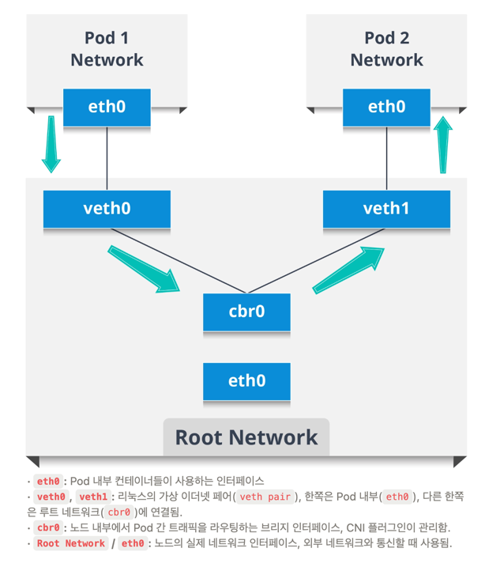
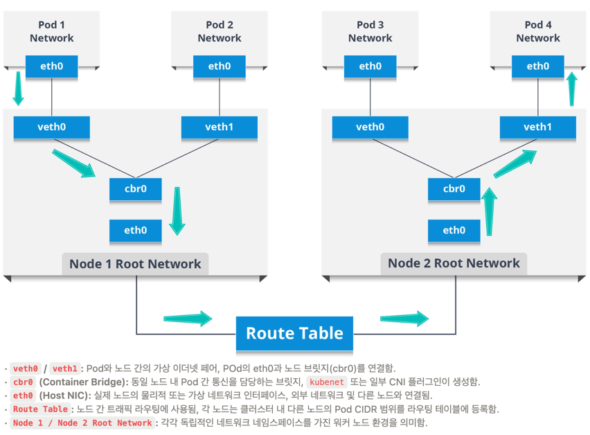
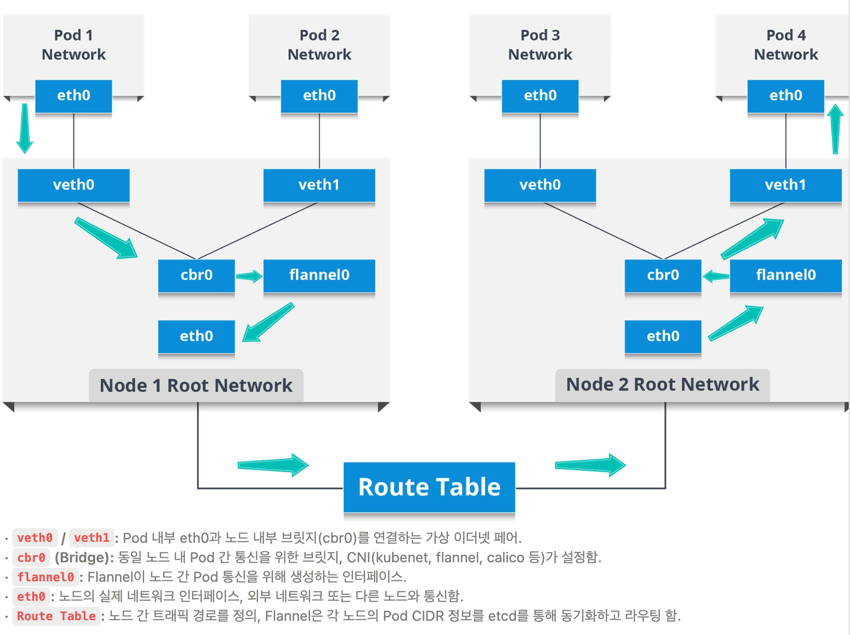
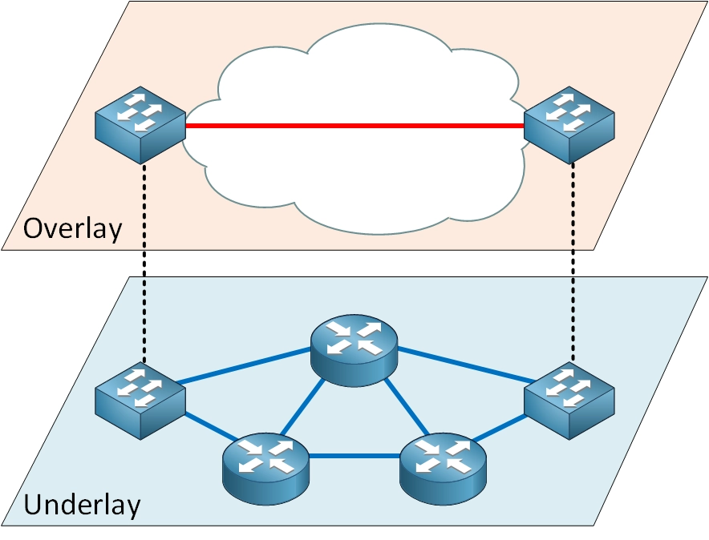

# TIL Template

## 날짜: 2026-07-22

### 스크럼
- 학습 목표 1 : Job/Cron Job
- 학습 목표 2 : Networking
- 학습 목표 3 : VXLAN, IP in IP, BGP
- 학습 목표 4 : CNI

### 새로 배운 내용
#### 주제 1: Job/Cron Job
### 1. Job (일회성 배치 작업 컨트롤러)
> **💡 핵심 개념**: 한 번 실행되어 성공(`exit 0`)으로 끝나는 일회성/단일 작업을 관리하는 컨트롤러

#### ❓ Deployment vs Job
* **Deployment**: 애플리케이션을 항상 **실행(Running) 상태**로 유지하고 관리
* **Job**: 작업을 수행하고 **성공적으로 완료(Completed)된 후 종료**되는 프로세스를 관리

- ### 💡 Job 사용 이유

| 이유 | 설명 |
| :--- | :--- |
| **단일 작업의 자동화** | Job은 일회성/단일 작업을 자동화하여 수작업 실행의 필요성을 줄입니다.<br>사용자는 반복적인 관리 부담에서 벗어나 작업이 성공적으로 완료되도록 보장받을 수 있습니다. |
| **작업 완료 보장** | 작업 도중 Pod이 실패할 경우, Job은 자동으로 Pod을 다시 생성하여 작업을 재시도합니다.<br>작업이 실패 없이 성공적으로 종료될 수 있도록 지원합니다. |
| **안정성 제공** | Job은 Pod의 재시작 정책과 병렬 처리 옵션을 통해 작업의 성공을 보장합니다.<br>필요시 여러 Pod을 병렬로 실행하여 대규모 작업 속도를 높일 수 있습니다. |
| **운영 효율성 향상** | 사람이 모든 작업을 실시간으로 모니터링하지 않아도 Job이 자동으로 작업 상태를 관리하며, 완료된 작업의 로그를 통해 결과를 추후 검토할 수 있습니다. |

- ### ⚙️ Job 주요 특징

| 특징 | 설명 |
| :--- | :--- |
| **작업 완료 보장** | - Job은 지정된 작업이 성공적으로 완료될 때까지 Pod을 생성하고 관리합니다.<br>- 작업 도중 Pod이 실패하면 새로운 Pod을 생성하여 작업을 재시작합니다.<br>- 성공적으로 완료된 Pod의 개수를 기준으로 작업의 완료 여부를 판단합니다. |
| **병렬 처리** | - 여러 Pod을 병렬로 실행하여 대규모 작업의 처리 속도를 향상시킬 수 있습니다.<br>- **`completions`**: 작업 완료를 위해 필요한 총 Pod의 수 정의<br>- **`parallelism`**: 동시에 실행될 수 있는 Pod의 최대 수 정의 |
| **Pod 자동 종료 및 리소스 해제** | - 작업이 완료되면 관련 Pod의 실행을 종료시켜 리소스를 해제합니다.<br>- 완료된 작업의 로그 및 완료 상태 정보는 유지되어 추후 확인이 가능합니다. |
- ### 🧩 Job 주요 구성 요소 및 동작 정책

| 구성 요소 | 설명 |
| :--- | :--- |
| **Job 객체의 상태** | `Active`, `Succeeded`, `Failed`와 같은 상태 정보를 통해 현재 작업의 진행 상황을 파악합니다. |
| **Retry 정책** | Pod 실행 실패 시, 지정된 재시도 횟수(`backoffLimit`) 및 정책에 따라 작업을 자동으로 재시도합니다. |
| **TTL (Time To Live)** | 작업이 완료된 Job 객체가 클러스터에 남아 있는 시간(`ttlSecondsAfterFinished`)을 설정하여 불필요한 리소스 잔재를 자동 정리합니다. |
- ### ⚙️ Job 동작 순서

| 순서 | 동작 | 설명 |
| :---: | :--- | :--- |
| **1** | **Pod 생성 및 관리** | Job은 `spec.template`에 정의된 Pod 템플릿을 기반으로 Pod을 생성하고 관리를 시작합니다. |
| **2** | **작업 완료 확인** | - Job은 `completions` 필드에 정의된 횟수만큼 작업이 성공하면 완전히 종료됩니다.<br>- Pod이 정상 종료(Exit code 0)되거나, 실패 후 재시도를 거쳐 성공하면 완료로 간주합니다. |
| **3** | **Pod 실패 처리** | Pod 실행 중 오류가 발생하여 실패하면, Job은 지정된 재시도 한도(`backoffLimit`) 내에서 새 Pod을 재생성하여 작업을 재시도합니다. |

#### 📄 Job YAML 예시 및 실무 활용 사례

```yaml
apiVersion: batch/v1
kind: Job
metadata:
  name: example-job
spec:
  completions: 3            # 총 3번의 성공 완료 필요
  parallelism: 2            # 동시에 2개씩 병렬 실행
  backoffLimit: 3           # 최대 3번까지 재시도
  template:
    spec:
      containers:
      - name: example-container
        image: busybox
        command: ["sh", "-c", "echo Hello World! && sleep 30"]
      restartPolicy: OnFailure  # 실패 시 Pod 재시작
```
주요 사용 사례:

데이터베이스 스키마 마이그레이션 및 DB 초기화

대용량 파일/이미지 변환 및 일회성 데이터 이관

테스트 데이터 생성 및 배포 전 사전 작업


---
### 1. CronJob (주기적 정기 작업 컨트롤러)
> **💡 핵심 개념**: 정해진 스케줄(크론 표현식)마다 자동으로 Job을 생성하고 실행해 주는 컨트롤러
- ### ⏰ CronJob 사용 이유

| 이유 | 설명 |
| :--- | :--- |
| **반복 작업의 자동화** | CronJob은 특정 시간 간격이나 주기에 따라 배치 작업을 자동으로 실행합니다.<br>별도의 수작업 관리 없이 정기적인 반복 작업이 정확히 실행되도록 보장합니다. |
| **스케줄 관리의 유연성** | 크론 형식(`Cron Expression`)을 사용하여 작업 실행 주기를 매우 세밀하게 설정할 수 있습니다.<br>*(예: 매일 자정, 매주 월요일, 매시간 등)* |
| **작업 누락 방지** | `startingDeadlineSeconds` 옵션을 사용해 클러스터 지연 등으로 지정된 시간에 실행되지 못한 작업을 감지하고 추후 실행할 수 있습니다. |
| **중복 실행 제어 가능** | `concurrencyPolicy`를 통해 작업의 중복 실행 여부를 세밀하게 제어할 수 있습니다.<br>필요에 따라 이전 작업을 건너뛰거나 중단하고 새로운 작업을 실행하는 식의 유연한 운영이 가능합니다. |
- ### ⏰ CronJob 주요 특징

| 특징 | 설명 |
| :--- | :--- |
| **정기적 작업 관리** | CronJob은 지정된 시간이나 간격에 따라 자동으로 Job을 생성하고 실행합니다.<br>*(예: 매일 자정 데이터 백업)* |
| **스케줄 관리** | 크론 형식(`Cron Expression`)의 스케줄 표현식을 사용하여 실행 주기를 유연하게 설정할 수 있습니다.<br>*(예: `0 9 * * 1` ➔ 매주 월요일 오전 9시)* |
| **작업 내역 관리** | - 실행된 Job의 히스토리 및 기록을 관리합니다.<br>- 성공(`successfulJobsHistoryLimit`) 및 실패(`failedJobsHistoryLimit`)한 작업 기록 수를 제한하여 클러스터 리소스를 효율적으로 유지합니다. |
| **실행 보장** | 지정된 스케줄 시간에 실행되지 못한 작업(시작 지연 등)이 있을 경우, 설정 정책(`startingDeadlineSeconds`)에 따라 이를 감지하여 추후 실행할 수 있습니다. |

- ### 🧩 CronJob 주요 구성 요소 및 정책

| 구성 요소 | 설명 |
| :--- | :--- |
| **스케줄 표현식** | `spec.schedule` 필드에서 크론 형식을 사용해 작업 실행 주기를 정의합니다.<br>*(예: `0 0 * * *` ➔ 매일 자정 실행)* |
| **Job 템플릿** | `spec.jobTemplate`에 실행될 Job의 구체적인 설정을 정의하며, Pod 템플릿 및 재시작 정책(`restartPolicy`) 등을 포함합니다. |
| **성공/실패 기록 제한** | `successfulJobsHistoryLimit` 및 `failedJobsHistoryLimit`를 설정하여 클러스터에 유지할 완료된 작업 기록의 개수를 제한합니다. |
| **동시 실행 정책** | `spec.concurrencyPolicy`를 설정하여 이전 작업이 끝나지 않았을 때 새로 실행되는 Job과의 중복 제어 방식을 지정합니다.<br>- **`Allow`**: 중복 실행 허용 (기본값)<br>- **`Forbid`**: 이전 작업이 실행 중이면 새 작업 건너뜀<br>- **`Replace`**: 진행 중인 이전 Job을 취소/중지하고 새 Job 실행 |

- ### ⚙️ `concurrencyPolicy` (동시 실행 정책)

| 정책 | 동작 설명 |
| :--- | :--- |
| **`Allow`** *(기본값)* | 이전 Job이 실행 중이어도 스케줄 시간이 되면 **새 Job을 중복 실행** |
| **`Forbid`** | 이전 Job이 아직 실행 중이면 이번 스케줄 실행을 **건너뜀** |
| **`Replace`** | 실행 중이던 이전 Job을 **종료(취소)하고 새로운 Job으로 교체** 실행 |

- ### ⚙️ CronJob 동작 순서

| 순서 | 동작 | 설명 |
| :---: | :--- | :--- |
| **1** | **스케줄링** | `spec.schedule`에 정의된 크론 표현식 주기에 도달하면 CronJob 컨트롤러가 이를 감지합니다. |
| **2** | **Job 생성 및 실행** | 지정된 스케줄 시점에 맞춰 `spec.jobTemplate`에 설정된 사양을 기반으로 새로운 Job 객체를 생성하고 Pod 실행을 개시합니다. |
| **3** | **기록 관리** | 작업 완료 후, `successfulJobsHistoryLimit` 및 `failedJobsHistoryLimit` 설정값에 따라 보존할 히스토리 개수를 유지하고 초과한 옛 기록을 자동 정리합니다. |

- ### 🔄 Job vs CronJob 비교

| 항목 | Job | CronJob |
| :--- | :--- | :--- |
| **주요 목적** | 단일(일회성) 작업을 실행하고 관리 | 정기적으로 실행되는 작업(Job)을 스케줄링하고 관리 |
| **스케줄링 기능** | 없음 (수동 실행 또는 이벤트 기반 시점 실행) | 크론 형식(`Cron Expression`)을 사용해 주기적으로 작업 실행 |
| **Pod 생성 조건** | 정의된 Pod 템플릿을 기반으로 작업이 완료될 때까지 Pod 생성 | 설정된 스케줄 시점에 Job을 생성하고, 해당 Job이 Pod 템플릿 기반으로 실행 |
| **재시도** | 작업 실패 시 지정된 정책(`backoffLimit`)에 따라 Pod을 다시 생성하여 작업 완료 보장 | 지정된 Job 내부 설정에 따라 실패한 작업 재시도 처리 가능 |
| **중복 실행 관리** | 기본적으로 별도의 중복 실행 방지 메커니즘 없음 | `concurrencyPolicy`를 이용해 중복 실행 허용(`Allow`), 금지(`Forbid`), 대체(`Replace`) 설정 |
| **상태/기록 관리** | 작업의 상태(`Active`, `Succeeded`, `Failed`)를 통해 진행 상황 확인 | 완료된 Job의 성공(`successfulJobsHistoryLimit`) 및 실패(`failedJobsHistoryLimit`) 기록 개수 보존 및 관리 |
| **주요 사용 사례** | - 배치 데이터 처리<br>- 파일 변환 및 업로드<br>- 데이터베이스 마이그레이션 | - 정기적인 데이터 백업<br>- 시스템 로그 및 임시 파일 정리<br>- 주기적 보고서 생성 및 알림 발송 |

---

#### 주제 2: NETWORKING
> **💡 핵심 개념**: Kubernetes Networking은 클러스터 내부의 Pod 및 Service 간 통신, 그리고 외부 네트워크와의 연결 경로를 안전하고 효율적으로 구성·관리하는 시스템입니다.

- ### 💡 쿠버네티스 네트워크(Networking) 구조를 알아야 하는 이유

| 이유 | 설명 |
| :--- | :--- |
| **클러스터 내 통신 원리 이해** | Pod와 서비스(Service) 간의 트래픽 흐름과 네트워크 구조를 정확히 이해하여 효율적이고 안정적인 시스템 네트워크를 설계·관리할 수 있습니다. |
| **문제 발생 시 진단과 해결** | 트래픽 경로 오류, IP 충돌, CNI 연동 이슈 등 네트워크 장애 발생 시 원인을 정확히 파악하고 신속하게 대응(Troubleshooting)할 수 있습니다. |
| **성능과 안정성 보장** | `iptables`나 `IPVS` 등 커널 수준의 로드밸런싱 방식을 상황에 맞게 활용하여 트래픽을 최적화하고 네트워크 병목 현상을 예방할 수 있습니다. |
| **외부 통신 설계** | NodePort, LoadBalancer, Ingress 등 서비스 리소스를 적절히 활용하여 외부 환경과의 안정적이고 보안성이 높인 통신 채널을 설계할 수 있습니다. |

### 1. Pod Network
- 
- ### 🌐 Pod 네트워크 주요 특징

| 특징 | 설명 |
| :--- | :--- |
| **Pod 고유 IP** | Pod가 생성될 때, 쿠버네티스는 Pod 네트워크 내 고유한 IP를 할당합니다. |
| **컨테이너 간 네트워크 공유** | Pod 내 모든 컨테이너는 동일한 네트워크 네임스페이스를 공유하며, 동일한 IP를 사용하고 포트(`localhost`)를 통해 서로 통신합니다. |
| **Pause 컨테이너** | Pod의 네트워크 네임스페이스를 유지하며, Pod 내 모든 컨테이너가 동일한 네트워크 환경을 공유할 수 있도록 기반을 제공합니다. |

- ### 🔄 Pod 네트워크 동작 순서

| 순서 | 단계 | 설명 |
| :---: | :--- | :--- |
| **1** | **Pod 생성 시** | - Pod는 새로운 네트워크 네임스페이스와 IP를 부여받습니다.<br>- Pause 컨테이너가 생성되어 Pod 네트워크를 유지 관리합니다. |
| **2** | **Pod 내부 통신** | 동일한 네트워크 네임스페이스를 공유하기 때문에 `localhost` 기반으로 포트를 구분하여 컨테이너 간 통신을 수행합니다. |
| **3** | **Pod 외부 통신** | CNI(Container Network Interface) 등 네트워크 플러그인을 통해 트래픽이 라우팅되며, 타 Pod 간 또는 외부 네트워크와의 연결이 이루어집니다. |

- ### 2. Node Network
- 
- ### 🖥️ Node Network (노드 네트워크) 주요 구성 요소 및 동작

| 항목 | 설명 |
| :--- | :--- |
| **노드 간 통신 보장** | CNI / 네트워크 플러그인을 통해 서로 다른 노드에 위치한 Pod끼리도 NAT 없이 직접 통신할 수 있도록 라우팅 체계를 제공합니다. |
| **가상 인터페이스 생성** | Pod 생성 시 호스트 네트워크에 가상 인터페이스 페어(`veth` pair)를 생성하여 Pod의 네트워크 네임스페이스와 노드의 호스트 네트워크를 연결합니다. |
| **컨테이너 브리지 (`cbr0`)** | `kubenet` 환경에서 노드 내부 가상 네트워크 브리지를 생성하여 동일 노드 내 Pod 간 트래픽을 중계합니다. |
| **IP 할당** | 각 Pod은 노드에 할당된 가상 네트워크 CIDR(Subnet) 대역 범위 내에서 고유한 IP를 지정받습니다. |
| **트래픽 라우팅** | 외부 네트워크로 나가는 트래픽에 대해 노드 IP 기반으로 NAT(iptables / IPVS)를 수행하여 외부 인프라와 연결을 유지합니다. |

- ### 🔄 Node Network 동작 순서

| 순서 | 단계 | 설명 |
| :---: | :--- | :--- |
| **1** | **Pod와 호스트 연결** | Pod 내 네트워크 인터페이스는 호스트 네트워크의 가상 인터페이스(`veth` pair)와 1:1로 연결됩니다. |
| **2** | **브리지를 통한 통신** | 동일 노드 내의 Pod 간 통신은 컨테이너 네트워크 브리지(`cbr0`)를 통해 직접 중계됩니다. |
| **3** | **외부 통신** | Pod 네트워크 CIDR 대역 외부로 나가는 트래픽은 노드의 IP를 거쳐 NAT(Network Address Translation) 방식으로 라우팅됩니다. |

- ### 3. Service Network
- 
- ### 🛠️ Service Network 주요 구성 요소 및 동작

| 항목 | 설명 |
| :--- | :--- |
| **서비스 IP** | 서비스는 서비스 네트워크 CIDR 범위 내에서 고유 가상 IP(ClusterIP)를 할당받아, 클러스터 내 트래픽의 논리적 엔드포인트로 사용됩니다. |
| **엔드포인트 관리** | Endpoints 오브젝트는 서비스와 연결된 실제 Pod IP/포트 목록을 유지하며, API 서버가 Pod의 상태 변화를 지속적으로 감시하여 자동 갱신합니다. |
| **트래픽 처리 방식** | `flannel0`(Overlay CNI) 및 `cbr0` 인터페이스가 실제 파드 간 네트워크 경로를 구성하고, `kube-proxy`는 그 위에서 서비스 IP로 들어온 요청을 iptables/IPVS 규칙을 통해 적절한 Pod로 로드밸런싱 및 전달합니다. |

- ### 🔄 Service Network 트래픽 전달 순서

| 순서 | 단계 | 설명 |
| :---: | :--- | :--- |
| **1** | **서비스와 Pod 연결** | 서비스 생성 시 라벨 셀렉터(`selector`)를 기반으로 타깃 Pod을 탐색하고, 서비스 IP(ClusterIP)를 Endpoints(또는 EndpointSlice)를 통해 실제 Pod IP들과 매핑합니다. |
| **2** | **트래픽 흐름** | 서비스 IP로 들어온 요청은 `kube-proxy`가 커널에 등록한 규칙(`iptables` 또는 `IPVS`)을 통해 부하분산되어 대상 Pod의 IP로 직접 전달됩니다. |

### 4. 클러스터 외부 통신 및 Ingress

외부 트래픽 수신(Ingress) 및 외부 API/패키지 연결(Egress)을 관리하기 위해 세 가지 주요 접근 방식을 사용합니다.

#### 🌐 외부 접근 방식 비교

| 구분 | 설명 | 특징 / 단점 |
| :--- | :--- | :--- |
| **NodePort** | 노드의 특정 포트(30000~32767)를 직접 오픈하여 서비스에 연결 | 보안 노출 면이 넓어지며, URL 기반 L7 라우팅 불가 |
| **LoadBalancer** | 클라우드 인프라(AWS NLB/ALB 등)의 외부 로드밸런서를 자동으로 생성 및 연동 | 외부 접근 포인트는 명확하나, 서비스마다 생성 시 비용 증가 |
| **Ingress** | L7 (HTTP/HTTPS) 웹 애플리케이션 계층 기반 라우팅 제어 리소스 | 도메인, URL Path별 라우팅 단일 진입점(Single Entry Point) 제공 |
---
- ### 🧱 쿠버네티스 주요 네트워크 구성 요소 역할 요약

| 구성 요소 | 핵심 역할 |
| :--- | :--- |
| **Pod IP** | 모든 Pod에 부여되는 고유 가상 IP (최종 통신 목적지) |
| **Service IP** | 동적으로 바뀌는 Pod IP들을 하나로 묶어주는 단일 가상 엔드포인트 |
| **CNI (Network Plugin)** | 실제 Pod 간 통신 경로(veth, VXLAN 등)를 구성하는 네트워크 구현체 *(Flannel, Calico, Cilium)* |
| **kube-proxy** | Service IP/Port 요청이 실제 Pod IP/Port로 전환되도록 노드 커널 규칙(`iptables`/`IPVS`) 등록 |
| **CoreDNS** | 클러스터 내 도메인 이름 풀이 (`backend-service` ➔ `10.96.20.30`) |
| **Ingress Controller** | HTTP/HTTPS L7 라우팅 및 SSL/TLS 종단 처리를 수행하는 리버스 프록시 *(Nginx, Traefik 등)* |

---

- ### 🔒 Network Policy (트래픽 접근 제어)

기본적으로 쿠버네티스 Pod 간 모든 통신은 허용(Allow All)되어 있습니다. 보안 강화를 위해 라벨 기반으로 수신(Ingress)/발신(Egress) 트래픽을 제어합니다.
```yaml
apiVersion: networking.k8s.io/v1
kind: NetworkPolicy
metadata:
  name: allow-client-to-server
spec:
  podSelector:
    matchLabels:
      role: server                 # 적용 대상: role=server 라벨을 가진 Pod
  ingress:
    - from:
        - podSelector:
            matchLabels:
              role: client         # role=client 라벨을 가진 Pod에서의 접근만 허용
      ports:
        - protocol: TCP
          port: 3000               # TCP 3000 포트 허용
  policyTypes:
    - Ingress
```
- ### 💡 실무 모범 사례 (Best Practices)

| 구분 | 모범 사례 설명 |
| :--- | :--- |
| **상호 통신은 Service Domain 이용** | Pod IP는 가변적이므로 코드 및 설정 파일(`application.yml` 등)에 IP를 직접 기재하지 않고, CoreDNS가 해석할 수 있는 서비스 이름(`backend-service:8080`)을 사용합니다. |
| **외부 노출 최소화** | 백엔드 API, DB 등 외부 직접 연결이 불필요한 모든 서비스는 `ClusterIP`로 격리하고, 클러스터 외부 접근은 단일 `Ingress` 진입점으로 통제하여 보안 노출 면을 최소화합니다. |
| **네임스페이스 구분 통신** | 서비스 호출 시 네임스페이스 위치에 맞춰 FQDN 도메인을 사용합니다.<br>- **동일 네임스페이스**: `backend-service`<br>- **타 네임스페이스**: `<service-name>.<namespace>.svc.cluster.local` |
| **보안 정책 적용 (NetworkPolicy)** | 기본 전체 허용(Allow All) 정책을 지양하고, `NetworkPolicy`를 통해 `Frontend` ➔ `Backend` ➔ `Database`와 같이 계층별 최소 권한 트래픽 경로만 허용합니다. |

---

- ### ⚡ kube-proxy의 개념과 동작 원리

> **💡 핵심 개념**: Service는 실제 네트워크 인터페이스가 없는 **가상의 리소스**입니다. `kube-proxy`는 Service로 들어온 요청이 실제 존재하는 Pod로 전달될 수 있도록 **각 노드의 커널에 네트워크 라우팅 규칙을 설정하는 컴포넌트**입니다.

---
- ### 💡 Service와 kube-proxy의 본질

| 구분 | 설명 |
| :--- | :--- |
| **Service의 실체** | - Pod, Node, NIC(네트워크 인터페이스)는 실제로 존재하지만, Service는 특정 IP 대역을 Logical하게 묶어둔 **가상의 리소스("대표 가상 번호")**입니다. |
| **자주 하는 오해** | - 이름이 `proxy`라고 해서 모든 트래픽 패킷이 `kube-proxy` 프로세스를 직접 거쳐(Proxying) 가는 것이 **아닙니다**. |
| **진짜 역할** | - 트래픽이 통과하는 통로가 아니라, **Linux 커널 라우팅 테이블(`iptables`/`IPVS`)에 규칙을 등록해 주는 설정자**입니다. |
---

- #### 📌 모든 노드에 kube-proxy가 배치되는 이유

* **DaemonSet 형태로 배포**: `kube-system` 네임스페이스에서 컨트롤 플레인 및 모든 워커 노드에 Pod 형태로 1개씩 자동 배치됩니다. (`kubectl get pods -n kube-system -o wide`)
* **이유**: 어느 노드의 Pod가 어떤 Service를 호출할지 예측할 수 없으므로, **모든 노드가 서비스 목적지 매핑 테이블을 항상 최신 상태로 보유**해야 하기 때문입니다.

---

- #### 🔄 kube-proxy 6단계 동작 프로세스

```
[API Server] ──── (1,2. Service & EndpointSlice 감시) ────> [kube-proxy]
                                                                │
                                                  (3,4. 커널에 네트워크 규칙 설정)
                                                                ▼
[Frontend Pod] ── (5,6. Service IP로 요청) ──> [Linux 커널 (DNAT: Pod IP로 변환)] ──> [Backend Pod]

```

| 순서 | 단계 | 상세 동작 |
| --- | --- | --- |
| **1** | **Service 정보 감시** | API Server를 실시간 감시(Watch)하여 생성/수정된 Service 정보(ClusterIP, Port 등)를 확인합니다. |
| **2** | **EndpointSlice 감시** | 연결된 실제 타깃 Backend Pod 목록(Pod IP, TargetPort)을 감시합니다. |
| **3** | **Backend 목록 확인** | 트래픽을 보낼 수 있는 유효한 Backend Pod IP 리스트를 획득합니다. |
| **4** | **노드 커널 규칙 구성** | 노드의 Linux 커널 공간(`iptables` / `IPVS`)에 라우팅 및 부하분산 규칙을 설치합니다. |
| **5** | **커널 수준 백엔드 선택** | Frontend Pod에서 Service IP로 요청을 보내면, **Linux 커널이 직접** 규칙에 따라 목적지 Pod를 선택합니다. |
| **6** | **DNAT (목적지 IP 변환)** | 패킷의 목적지 주소를 Service IP(`10.96.20.30:80`)에서 실제 Pod IP(`10.244.2.15:8080`)로 **DNAT**(Destination NAT)하여 전송합니다. |

---

- ### 🛠️ kube-proxy 주요 동작 모드

| 동작 모드 | 설명 |
| :--- | :--- |
| **`iptables` Mode** | - Service IP:Port 요청을 Endpoint Pod IP:Port로 변환하는 `iptables` 규칙 생성<br>- 커널 수준에서 DNAT를 수행하며 가장 흔하게 사용되는 기본 방식 (`iptables-save \| grep KUBE-SVC`) |
| **`IPVS` Mode** | - Linux 커널의 IPVS 기술을 사용해 대규모 클러스터에서 높은 성능과 다양한 로드밸런싱 알고리즘 제공 |
| **`nftables` Mode** | - 최신 Linux 커널의 `nftables` Subsystem을 활용하는 차세대 모드 |
---

- #### ⚙️ 전체 트래픽 흐름 요약

$$\text{Frontend Pod} \xrightarrow{\text{Service IP:Port 호출}} \text{Linux 커널 라우팅 규칙} \xrightarrow{\text{DNAT 변환}} \text{CNI 네트워크 경로} \xrightarrow{\text{전달}} \text{Backend Pod IP:TargetPort}$$

1. **Frontend Pod**: `backend-service` (예: `10.96.20.30:80`)로 요청 발송
2. **kube-proxy 역할**: 미리 API Server를 통해 받아온 엔드포인트(`10.244.2.15:8080`) 정보를 노드의 커널 라우팅 테이블에 최신화해 둠
3. **Linux 커널**: 커널 라우팅 테이블을 통해 목적지 IP/Port를 실제 Pod IP/Port로 변환(DNAT)
4. **CNI**: 변환된 패킷을 실제 물리/가상 네트워크 경로를 타고 대상 Backend Pod로 최종 배달

---
#### 주제 3: VXLAN, IP in IP, BGP
- #### 🌐 CNI 네트워크 패킷 전달 방식: VXLAN, IP-in-IP, BGP

> **💡 핵심 개념**: 서로 다른 노드에 위치한 Pod 간 통신을 위해 패킷을 캡슐화(Overlay)하여 전달하거나, 라우팅 프로토콜(BGP)을 통해 물리 네트워크(Underlay)에 직접 패킷을 보냅니다.

---

- ### 1. 오버레이 네트워크 캡슐화 기술 (VXLAN vs IP-in-IP)

#### 📦 패킷 구조 비교

- ##### 🔹 IP-in-IP 구조 (Layer 3 over Layer 3)
> IP 패킷 위에 Outer IP 헤더만 추가하는 단순한 방식입니다.


- ##### 🔹 VXLAN 구조 (Layer 2 over Layer 3)
> 원본 이더넷 프레임 전체를 UDP 패킷에 담아 전달하는 방식입니다.


---

#### 📊 VXLAN vs IP-in-IP 주요 특징 비교

| 구분 | VXLAN | IP-in-IP |
| :--- | :--- | :--- |
| **캡슐화 대상** | 이더넷 프레임 (L2 전체) | IP 패킷 (L3) |
| **계층 관점** | **Layer 2 over Layer 3** | **Layer 3 over Layer 3** |
| **외부 프로토콜** | UDP (기본 포트 `4789`) | IP Protocol 4 (IP-in-IP) |
| **주요 헤더** | Outer Ethernet + Outer IP + UDP + VXLAN | Outer IP |
| **터널 끝점** | VTEP (VXLAN Tunnel End Point) | IP Tunnel Interface |
| **논리 네트워크 식별** | VNI (VXLAN Network Identifier) 제공 | 별도 VNI 없음 |
| **헤더 오버헤드** | **큼** (추가 헤더 크기가 커 MTU 조정 필수) | **상대적으로 작음** |
| **네트워크 호환성** | UDP 트래픽이므로 대부분 환경에서 무난히 통과 | 방화벽/클라우드에서 IP Protocol 4 허용 여부 확인 필요 |

---

### 2. BGP (Border Gateway Protocol) 직접 라우팅

> **💡 BGP란?**: 패킷을 직접 캡슐화하는 기술이 아니라, "어떤 Pod IP 대역(CIDR)으로 가려면 어느 노드(Next Hop)로 가야 하는지" 경로 정보만 노드 및 네트워크 장비 간에 교환하는 **컨트롤 플레인 라우팅 프로토콜**입니다.

#### 🔄 BGP 동작 흐름

1. **BGP 이웃(Peer) 형성**: Node A와 Node B는 **TCP 179번 포트**를 통해 BGP 프로세스 간 세션을 맺습니다.
2. **경로 정보 광고 (NLRI)**:
    - **Node A ➔ Node B**: `10.244.1.0/24` (Next Hop: `192.168.10.11`)
    - **Node B ➔ Node A**: `10.244.2.0/24` (Next Hop: `192.168.10.12`)
3. **Linux 라우팅 테이블 반영**: 학습한 경로를 커널 라우팅 테이블에 등록합니다. (`10.244.2.0/24 via 192.168.10.12`)
4. **데이터 전달 (Data Plane)**: 실제 패킷 전달 시 BGP가 직접 운반하지 않고, **Linux 커널 라우팅 테이블**을 참조하여 패킷을 보냅니다.
---

#### 🕸️ BGP 토폴로지 구성 방식

| 구성 방식 | 설명 | 특징 |
| :--- | :--- | :--- |
| **Full Mesh** | 모든 노드가 서로 1:1로 BGP Peer를 형성하는 방식 | - 노드 수 $N$개일 때 Peer 수: $\frac{N(N-1)}{2}$<br>- 소규모 클러스터(노드 수 적음)에 적합 |
| **Route Reflector** | 중계 역할을 하는 **Route Reflector**를 두어 경로를 중앙 집계하는 방식 | - 노드가 수백 대 이상인 대규모 클러스터에 적합<br>- Peer 구성 복잡도를 $O(N)$으로 획기적으로 줄임 |

---

### 3. 패킷 전달 방식별 데이터 흐름 (Data Flow)

#### 1) VXLAN (Overlay)
$$ \text{Pod A (원본 Frame)} \xrightarrow{\text{VTEP}} \text{UDP + VXLAN 캡슐화} \xrightarrow{\text{Underlay}} \text{Node B VTEP (디캡슐화)} \xrightarrow{} \text{Pod B} $$

#### 2) IP-in-IP (Overlay)
$$ \text{Pod A (원본 IP)} \xrightarrow{\text{Node A}} \text{Outer IP Header 추가} \xrightarrow{\text{Underlay}} \text{Node B (Outer IP 제거)} \xrightarrow{} \text{Pod B} $$

#### 3) BGP Direct / Native Routing (Non-Overlay)
$$ \text{Pod A (원본 IP)} \xrightarrow{\text{Node A}} \text{BGP 학습 경로 조회} \xrightarrow{\text{Pod IP 그대로 전송}} \text{Node B} \xrightarrow{} \text{Pod B} $$

> 💡 **혼합 형태 (IP-in-IP + BGP)**: Calico 등의 CNI에서는 **BGP로 경로를 학습**하고, 물리 네트워크가 Pod IP를 직접 라우팅하지 못하는 환경일 때 **실제 패킷은 IP-in-IP로 캡슐화**하여 보낼 수 있습니다.

---

### 🎯 상황별 CNI 기술 선택 가이드 (Best Practices)

| 방식 | 추천 사용 환경 | 장점 | 단점 / 주의사항 |
| :--- | :--- | :--- | :--- |
| **VXLAN** | - 언더레이(물리) 네트워크 설정 변경이 불가능할 때<br>- AWS, GCP, Azure 등 **퍼블릭 클라우드 환경** | - 구현이 단순함<br>- 대부분의 L3 네트워크에서 호환성 우수 | - 헤더 오버헤드가 가장 큼<br>- Interface MTU 값 조정 필수 |
| **IP-in-IP** | - L3 네트워크 기반 패킷 전송 시 오버헤드를 줄이고 싶을 때<br>- 클라우드/방화벽이 IP Protocol 4를 허용할 때 | - VXLAN 대비 캡슐화 헤더가 가볍고 처리 속도 빠름 | - 네트워크 장비/방화벽 정책에 따라 IP Protocol 4가 차단될 수 있음 |
| **BGP Native** | - 온프레미스(On-Premise) 및 하드웨어 라우터를 직접 제어 가능할 때<br>- 대규모 클러스터 및 초고속 패킷 처리가 필요할 때 | - 캡슐화 오버헤드가 전혀 없음 (**최고의 네트워크 성능**) | - 네트워크 팀의 전문적인 BGP 운영 지식 필요<br>- 인프라 구성 난이도 높음 |

---

### 🧱 네트워크 구성 요약

| 기술 | 핵심 요약 |
| :--- | :--- |
| **VXLAN** | - Ethernet Frame을 UDP 안에 캡슐화 (**Layer 2 over Layer 3**)<br>- VTEP와 VNI 사용<br>- 호환성이 뛰어나지만 헤더 오버헤드가 큼 |
| **IP-in-IP** | - IP Packet을 새로운 IP Packet 안에 캡슐화 (**Layer 3 over Layer 3**)<br>- 구조가 단순하고 오버헤드가 상대적으로 작음 |
| **BGP** | - 캡슐화 기술이 아니라 **도달 가능한 IP Prefix와 Next Hop 정보를 교환하는 프로토콜**<br>- 실제 패킷 전달은 BGP가 반영해 둔 **Linux 커널 라우팅**이 수행 |

---
#### 주제 4: CNI
> **💡 CNI란?**: 컨테이너 네트워크를 설정하고 관리하기 위한 표준화된 API

- ### 🔌 CNI (Container Network Interface) 주요 특징

| 특징 | 설명 |
| :--- | :--- |
| **표준화된 인터페이스** | - 컨테이너 런타임과 네트워크 플러그인 간 통신 규격을 표준화하여 네트워크 설정을 효율적으로 관리합니다.<br>- 특정 런타임 환경에 종속되지 않고 다양한 플러그인과 환경에서 일관된 동작을 보장합니다. |
| **확장성과 모듈화** | - 다양한 네트워크 플러그인을 지원하며, 필요에 따라 플러그인 교체 및 신규 추가가 간단합니다.<br>- Calico, Flannel, Weave Net 등을 통해 네트워크 정책 및 트래픽 제어를 세밀하게 설정할 수 있습니다. |
| **유연한 네트워크 구성** | - 네트워크 인터페이스 설정, IP 할당, 라우팅, NAT(Network Address Translation) 등 다양한 기능을 지원합니다.<br>- 노드 간 통신, 외부 네트워크 연결, Pod 간 네트워크 분리 등 다양한 네트워크 요구사항을 충족합니다. |

- ### 💡 CNI ↔ CNI 플러그인 규격 및 용어 구분

| 구분 | 개념 설명 | 대표 예시 |
| :--- | :--- | :--- |
| **CNI (Specification)** | 네트워크 플러그인이 준수해야 하는 **표준 규격/약속** | CNI Specification (v1.0.0 등) |
| **CNI 플러그인 (Plugin)** | CNI 규격에 맞춰 실제로 네트워크 경로를 구축하는 **구현체** | Flannel, Calico, Cilium |
| **네트워크 기능** | 플러그인이 제공하는 실질적인 네트워킹 및 보안 기능 | Pod IP 할당(IPAM), 라우팅, VXLAN/IPIP 터널링, NetworkPolicy |

- ### 💡 CNI(Container Network Interface)가 필요한 이유

| 이유 | 설명 |
| :--- | :--- |
| **Pod 간 통신 자동화** | Pod가 동적으로 생성되고 삭제될 때 IP 주소를 자동으로 할당하고 가상 네트워크 인터페이스를 연결하여 Pod 간 안정적인 통신을 보장합니다. |
| **다양한 네트워크 플러그인 지원** | Calico, Flannel, Cilium 등의 플러그인을 선택하여 오버레이 네트워크, 네이티브 라우팅, 보안 정책(NetworkPolicy) 등 환경에 맞는 기능을 활용할 수 있습니다. |
| **표준화된 인터페이스 제공** | 컨테이너 런타임(containerd, CRI-O 등)과 네트워크 플러그인 간 통신 규격을 규격화하여 다양한 클러스터 환경에서도 일관된 동작을 보장합니다. |
| **확장성과 유연성** | 소규모 개발 환경부터 대규모 운영 클러스터까지 유연하게 확장할 수 있으며, 필요 시 CNI 플러그인을 손쉽게 교체하거나 추가할 수 있습니다. |
| **클라우드 및 온프레미스 통합** | AWS, GCP 등 퍼블릭 클라우드의 VPC 기반 네트워크나 온프레미스 인프라 환경 모두에서 동일한 방식으로 네트워크 체계를 구축·통합 관리할 수 있습니다. |

- ### 🔄 CNI 동작 과정 (라이프사이클)

| 과정 | 단계 | 상세 동작 |
| :---: | :---: | :--- |
| **컨테이너 생성 시** | **1** | 컨테이너 런타임(containerd, CRI-O 등)이 새로운 컨테이너를 생성합니다. |
| | **2** | CNI 플러그인이 런타임으로부터 컨테이너 정보(컨테이너 ID, 네트워크 네임스페이스 등)를 전달받습니다. |
| | **3** | CNI 플러그인이 가상 네트워크 인터페이스(`veth` pair)를 생성하고 IP 주소를 할당하며, 필요한 라우팅 규칙을 설정합니다. |
| **컨테이너 종료 시** | **1** | 컨테이너 런타임이 컨테이너 종료 및 삭제를 요청합니다. |
| | **2** | CNI 플러그인이 연결된 네트워크 인터페이스 및 라우팅 설정을 정리하고, 할당했던 IP 등의 자원을 반환(해제)합니다. |

```aiignore
[사용자]
   │
   │ (kubectl apply)
   ▼
[API Server]
   │
   ▼
[Scheduler]
   │
   │ (Node 배정)
   ▼
[kubelet / containerd (CRI)]
   │
   │ (CNI 호출)
   ▼
[CNI Plugin] (veth 생성 / IP 할당 / 라우팅 설정)
   │
   │ (결과 반환)
   ▼
[Pod 네트워크 준비 완료]
```
- ### 🛠️ 주요 CNI 플러그인 3종 비교

| CNI 플러그인 | 주요 특징 및 특징 요약 | 장점 | 주의사항 / 단점 |
| :--- | :--- | :--- | :--- |
| **Flannel** | - 가장 단순한 구조의 L2/L3 오버레이 CNI<br>- 노드별로 Pod CIDR 대역을 분할 할당 | - 구성 및 설치가 매우 쉬움<br>- 경량화되어 자원 소모가 적음 | - 기본적으로 `NetworkPolicy` 차단 정책을 지원하지 않음 |
| **Calico** | - **BGP 기반 Native Routing**과 **IP-in-IP/VXLAN Overlay** 모두 지원<br>- 실무 운영 환경의 디폴트 표준 CNI | - 세밀한 L3/L4 보안 정책(`NetworkPolicy`)<br>- 오버레이 없이 최고 성능 제공 | - BGP 및 온프레미스 네트워크 라우팅에 대한 이해 필요 |
| **Cilium** | - Linux **eBPF** 기술 기반 차세대 CNI<br>- 커널 바이패스를 통해 패킷 전송 | - L7 계층 레벨 보안 및 뛰어난 관측성(Observability)<br>- 극상의 네트워크 처리 성능 | - 최신 Linux 커널 버전을 요구함 |

- ### 🖼️ Underlay Network vs Overlay Network

- **Underlay Network**
    - 실제 네트워크 장비(스위치, 라우터 등)와 물리적 케이블로 구성된 네트워크입니다.
    - 이 네트워크는 기본적인 데이터 전송을 담당합니다.

- **Overlay Network**
    - 물리 네트워크를 활용해 가상의 네트워크를 만드는 것입니다.
    - 여기서 트래픽은 IPIP같은 터널링 기술로 캡슐화되어 언더레이 네트워크를 통해 전달됩니다.

---
- ### 🐯 Calico 주요 특징

| 특징 | 설명 |
| :--- | :--- |
| **Native Routing 기반 네트워크 구성** | 오버레이(Overlay) 네트워크에 따른 캡슐화 없이, BGP를 활용해 기존 물리 네트워크 기반으로 Pod 간 트래픽을 직접 라우팅하여 높은 성능을 제공합니다. |
| **세분화된 네트워크 정책** | 쿠버네티스 기본 `NetworkPolicy` 외에도 Calico 전용 Custom Resource를 통해 L3/L4 수준의 미세하고 강력한 보안 정책(트래픽 허용 및 차단)을 설정할 수 있습니다. |
| **오버레이 네트워크 지원** | 물리 네트워크 설정 변경이 어려운 환경을 위해 필요 시 `IP-in-IP`나 `VXLAN` 형태의 오버레이 모드로 전환하여 노드 간 통신을 지원할 수 있습니다. |


- ### 🐯 Calico의 Pod 네트워크 동작 및 성능 특징

| 구분 | 설명 |
| :--- | :--- |
| **Pod 간 네트워크 구성** | - 각 Pod는 고유 IP를 부여받으며, Calico의 **Native Routing**을 통해 노드 간 직접 라우팅됩니다.<br>- 각 노드의 라우터 인터페이스를 통해 트래픽을 관리하므로 오버레이 네트워크 없이 Pod 간 통신이 가능합니다. |
| **호스트와 가상 인터페이스 연결** | - 호스트 네트워크 네임스페이스에 가상 인터페이스(`veth` pair)를 생성하여 Pod와 연결합니다.<br>- Pod 생성 시 가상 인터페이스가 호스트에 연결되고, 노드의 라우팅 테이블에 해당 Pod의 IP 경로가 자동 추가됩니다. |
| **성능 최적화** | - 기본적으로 오버레이 네트워크를 사용하지 않아 패킷 변환에 따른 성능 저하가 적습니다.<br>- Native Routing 방식을 사용해 추가 네트워크 계층 없이 물리적 네트워크 인프라를 그대로 활용합니다. |

---

- ### 🚀 Native Routing 개념 및 특징

| 항목 | 상세 내용 |
| :--- | :--- |
| **개념** | 오버레이(Overlay) 네트워크를 통한 패킷 캡슐화 없이, 기존 물리적 네트워크 인프라(스위치/라우터)를 그대로 활용하여 IP 패킷을 직접 라우팅하는 방식입니다. |
| **IP 관리** | 클러스터 내 각 노드와 Pod가 고유한 IP 주소를 가지며, 트래픽은 기존 네트워크 장비의 라우팅 테이블에 의해 직접 전달됩니다. |
| **주요 장점** | - **고성능 & 저지연**: 캡슐화(Encapsulation) 및 디캡슐화 과정이 없어 처리 속도가 빠르고 라텐시(Latency)가 낮습니다.<br>- **구조 간소화**: 네트워크 경로가 직관적이고 단순하여 트러블슈팅이 용이합니다. |
| **Calico 적용** | Calico는 기본(Default) 모드로 Native Routing을 활용하여 고성능과 대규모 확장성을 동시에 제공합니다. |

---

- ### 🛠️ Service Network (with Calico)

> Calico는 쿠버네티스의 서비스 네트워크에서 Pod 간 통신뿐만 아니라 외부 네트워크와의 연결까지 유기적으로 제어하고 관리합니다.

| 구분 | 상세 설명 |
| :--- | :--- |
| **네트워크 정책 지원** | - 서비스 네트워크 레벨에서도 `NetworkPolicy`를 통한 세밀한 트래픽 제어를 제공합니다.<br>- `ClusterIP`, `NodePort`, `LoadBalancer` 트래픽에 대해 특정 IP 대역, 포트, 프로토콜 기반의 허용/차단 규칙을 자유롭게 설정할 수 있습니다. |
| **BGP를 활용한 LoadBalancer** | - **BGP(Border Gateway Protocol)**를 활용해 외부 라우터와 경로를 직접 교환함으로써, 별도 외부 장비 없이 **베어메탈(온프레미스) 환경에서도 `LoadBalancer` 타입 서비스를 구현**할 수 있습니다.<br>- 클라우드 및 온프레미스 모두에서 외부 트래픽을 효율적으로 유입시킵니다. |
| **네이티브 라우팅 기반 성능 최적화** | - 서비스 트래픽 처리 시 캡슐화(Overlay) 없이 **Native Routing**을 활용해 지연(Latency)과 성능 손실을 최소화합니다.<br>- `ClusterIP`와 `NodePort` 트래픽 역시 물리 네트워크 라우팅을 타고 직관적이고 빠르게 전달됩니다. |

> 📌 **베어메탈(Bare-Metal) 환경**: 하이퍼바이저(가상화)나 클라우드 계층 없이 물리 서버에 OS 및 쿠버네티스를 직접 배포하여 운영하는 인프라 환경입니다.

---

### 🔀 CNI vs kube-proxy 역할 분담 비교

| 구분 | CNI 플러그인 | kube-proxy |
| :--- | :--- | :--- |
| **주요 대상** | **Pod 네트워크** | **Service 네트워크** |
| **주요 역할** | Pod에 IP를 할당하고 노드 간 실제 패킷 전달 경로(도로) 구축 | Service IP 요청을 실제 Pod Endpoint IP로 변환(DNAT)하는 규칙 등록 |
| **동작 시점** | 주로 **Pod 생성 및 삭제 시** 동작 | **Service 및 EndpointSlice 변경 시** 동작 |
| **대표 기술** | Flannel, Calico, Cilium | iptables, IPVS, nftables |
| **교통 비유** | **도로 및 차선을 깔아주는 건설 통신 공사** | **지번 주소를 도로명 주소로 바꿔주는 안내 시스템** |

$$\text{Service 요청 (backend-svc)} \xrightarrow{\text{kube-proxy (iptables 변환)}} \text{Pod IP 선택} \xrightarrow{\text{CNI (VXLAN/Native Routing)}} \text{목적지 Pod 도착}$$

---


### 오늘의 회고
- 헷갈리는 개념들이 많다. 자주 복습해야겠다.
- 네트워크 계층을 복습해야겠다.

### 참고 자료 및 링크
- [Kubernetes](https://app.notion.com/p/adapterz/2b1394a4806180c4910bd48fc6c9088a?v=2b1394a4806181d28e46000c32057799&source=copy_link)
- [Job/Cron Job](https://app.notion.com/p/adapterz/9-Job-Cron-Job-3a5394a48061808da1c3c6706b73d33e?v=34f394a4806181698231000c504cb665&source=copy_link)
- [Networking](https://app.notion.com/p/adapterz/10-Networking-3a5394a48061809ca774f0b17ae1904f?v=34f394a4806181698231000c504cb665&source=copy_link)
- [VXLAN, IP in IP, BGP](https://app.notion.com/p/adapterz/11-1-VXLAN-IP-in-IP-BGP-3a5394a480618071aa29c093987d71ef?v=34f394a4806181698231000c504cb665&source=copy_link)
- [CNI](https://app.notion.com/p/adapterz/11-CNI-3a5394a48061806a8de1c0d86a3e6941?v=34f394a4806181698231000c504cb665&source=copy_link)
