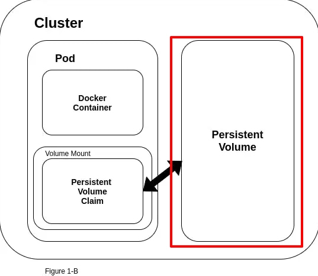
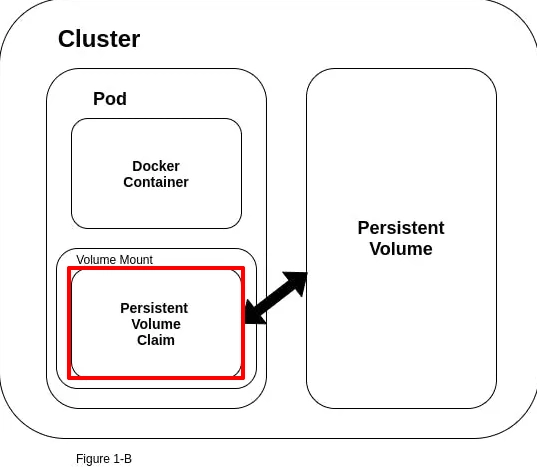
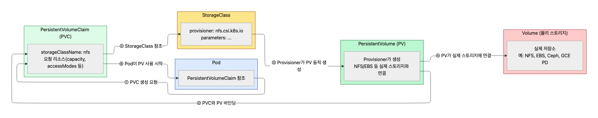
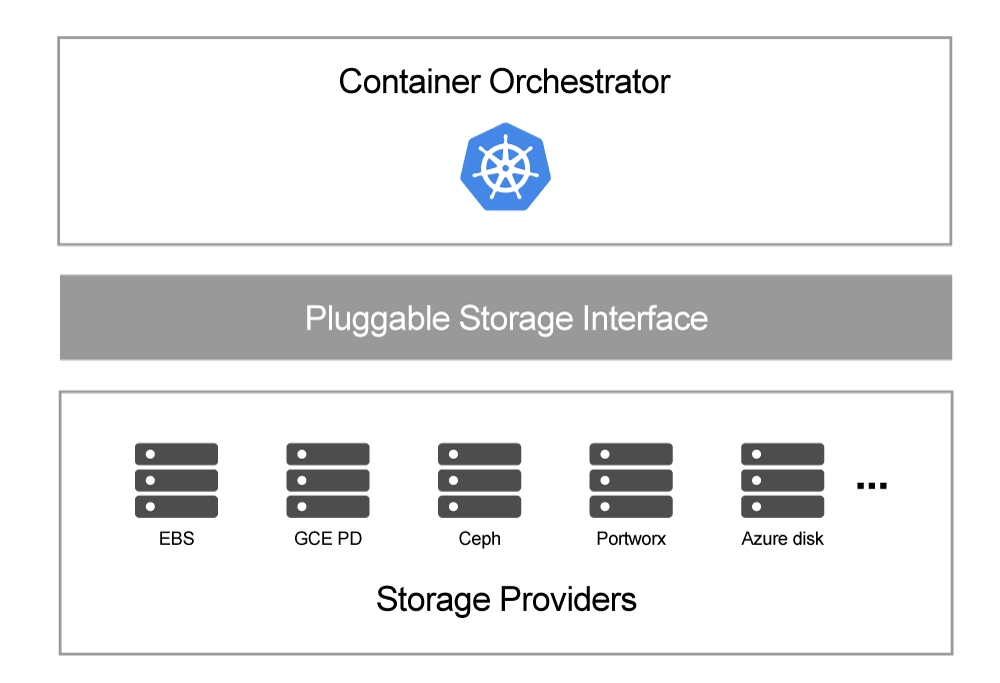
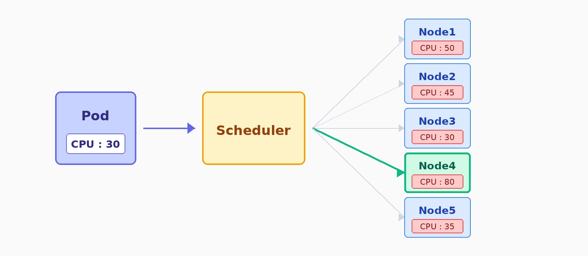
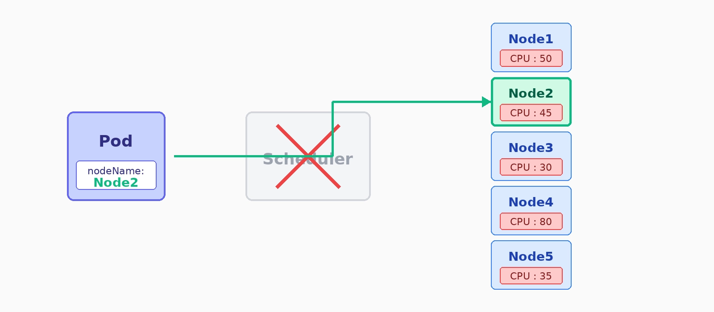
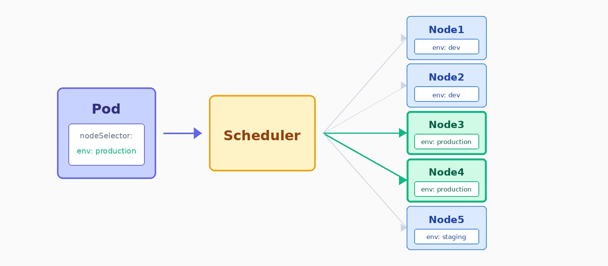
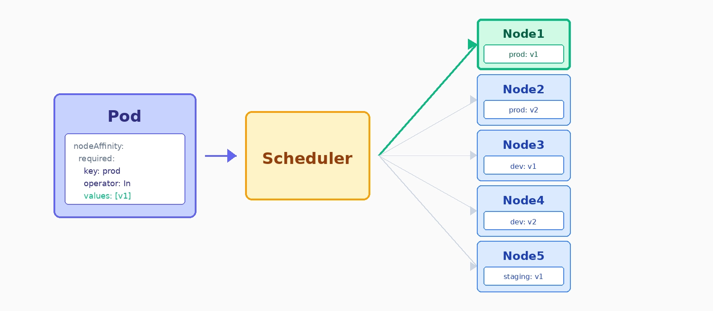
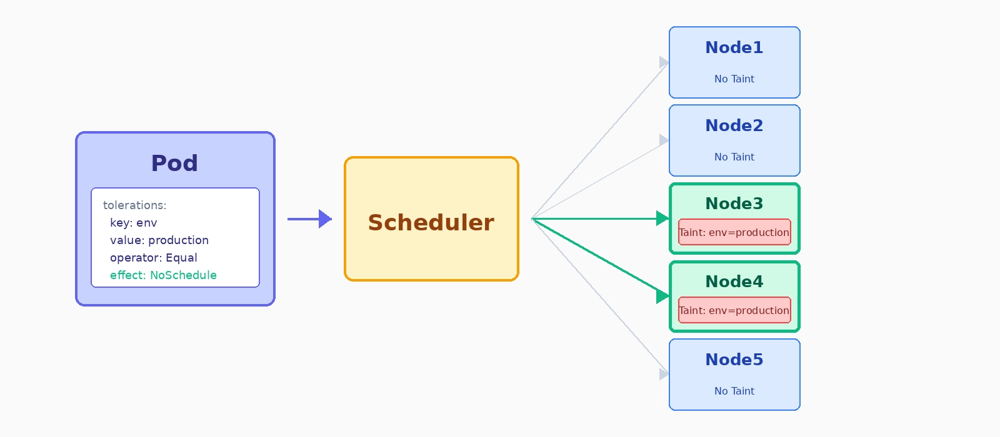

# TIL Template

## 날짜: 2026-07-23

### 스크럼
- 학습 목표 1 : Volume
- 학습 목표 2 : PV/PVC
- 학습 목표 3 : StorageClass
- 학습 목표 4 : StatefulSet
- 학습 목표 5 : Node Scheduling

### 새로 배운 내용
## 주제 1: Volume

Volume은 컨테이너의 파일 시스템 외부에 별도의 저장 공간을 연결하여, 데이터를 보존하거나 Pod 내부 컨테이너끼리 공유할 수 있게 하는 데이터 저장소입니다.

---

### 1. 사용 이유 및 특징

#### 💡 Volume이 필요한 이유

| 이유 | 설명 |
| --- | --- |
| **데이터의 지속성 보장** | 컨테이너는 재시작 또는 종료 시 데이터를 잃어버립니다. Volume은 동일 Pod 내 컨테이너가 재시작되어도 데이터를 보존합니다. |
| **컨테이너 간 데이터 공유** | Pod 내부 여러 컨테이너가 동일한 Volume을 마운트하면 파일 시스템을 통해 데이터를 공유할 수 있습니다. (예: App 컨테이너 ➔ 로그 생성, Logging 컨테이너 ➔ 로그 수집) |
| **설정 및 민감 정보 전달** | `ConfigMap` 및 `Secret`을 Volume 형태로 마운트하여 컨테이너 내부 파일로 안전하게 전달할 수 있습니다. |
| **다양한 스토리지 요구 충족** | 임시 데이터(`emptyDir`), 노드 디렉터리 접근(`hostPath`), 영구 데이터 보존(`PersistentVolume`) 등 다양한 스토리지 요구사항을 지원합니다. |
| **데이터 관리 용이성** | Volume은 Pod와 독립적으로 데이터를 관리할 수 있어 데이터 이동, 마이그레이션 및 앱 업그레이드 시 유리합니다. |

#### 📌 주요 특징

| 특징 | 설명 |
| --- | --- |
| **Pod 수명 종속성** | 기본 Volume은 Pod와 동일한 수명을 가집니다. Pod가 삭제되면 해당 Volume도 함께 삭제됩니다. |
| **디렉터리 마운트** | Volume은 Pod 내 컨테이너에서 접근 가능한 디렉터리로 마운트되어 기존 파일 시스템의 일부로 동작합니다. |
| **재시작 간 데이터 유지** | 컨테이너가 오류로 중단되거나 Liveness Probe 등에 의해 재시작되어도 Pod가 살아있다면 데이터를 유지합니다. |

---

### 2. YAML 속성 구조 (`volumes` vs `volumeMounts`)

* **`spec.volumes`**: Pod에서 사용할 저장 공간(스토리지)의 종류와 이름을 정의합니다.
* **`spec.containers[*].volumeMounts`**: 정의한 Volume을 컨테이너 내부의 어느 경로(`mountPath`)에 연결할지 지시합니다.

```yaml
spec:
  containers:
    - name: app
      image: nginx
      volumeMounts:
        - name: app-data
          mountPath: /data # 컨테이너 내부에서는 /data 디렉터리로 접근
  volumes:
    - name: app-data # app-data라는 이름의 emptyDir Volume 생성
      emptyDir: {}

```

---

### 3. Volume의 한계점

> ⚠️ **왜 일반 Volume은 "완벽한 영구 저장소"가 아닐까?**

1. **영구성 보장 불가 (노드 스케줄링 여파)**
* `hostPath`는 노드의 디렉터리에 저장되어 영구적인 것처럼 보이지만, 노드가 삭제되거나 Pod가 다른 노드로 재스케줄링되면 이전 노드의 데이터에 접근할 수 없습니다.


2. **노드 및 Pod 생명주기 종속성**
* Volume은 물리적으로 자신이 생성된 Pod 및 스케줄링된 노드 환경에 종속됩니다.


3. **스토리지 직접 관리 부담**
* 클러스터 내 수백 개의 Pod가 각 노드의 로컬 스토리지를 직접 사용하면 용량 제어나 외부 스토리지 연동 관리가 매우 복잡해집니다.


---

### 4. Volume 유형

#### ① emptyDir

Pod가 노드에 스케줄링될 때 생성되는 빈 디렉터리 형태의 임시 Volume입니다.

| 구분 | 설명 |
| --- | --- |
| **초기 상태** | 생성 시 항상 비어 있는 상태로 시작합니다. |
| **수명** | Pod 수명과 동일합니다. (Pod 삭제 시 데이터도 삭제, 컨테이너 재시작 시에는 유지) |
| **저장 위치** | 노드의 로컬 디스크 또는 메모리 (`medium: Memory` 설정 시 빠른 I/O 제공) |
| **주요 용도** | 임시 캐시 저장소, Pod 내 컨테이너 간 파일 공유, 로그 데이터 임시 저장 |

```yaml
apiVersion: v1
kind: Pod
metadata:
  name: emptydir-pod
spec:
  containers:
  - name: busybox
    image: busybox
    command: ["sh", "-c", "while true; do echo hello > /data/hello; sleep 5; done"]
    volumeMounts:
    - mountPath: /data
      name: temp-storage
  volumes:
  - name: temp-storage
    emptyDir: {}

```

* `busybox` 컨테이너가 `/data` 디렉터리에 `emptyDir`를 마운트하여 5초마다 문자열을 기록합니다.
* Pod 삭제 시 데이터가 함께 삭제됩니다.

---

#### ② hostPath

Pod가 실행 중인 노드의 파일 시스템 경로를 컨테이너에 직접 마운트하는 유형입니다.

| 구분 | 설명 |
| --- | --- |
| **저장 위치** | 노드의 파일 시스템 경로를 그대로 사용합니다. |
| **수명** | Pod 수명과 독립적이며, Pod가 삭제되어도 노드에는 데이터가 남습니다. |
| **제약 사항** | Pod가 다른 노드로 이동할 경우 이전 노드의 데이터에 접근할 수 없습니다. |
| **주요 용도** | 노드의 설정 파일 참조, 디버깅 및 시스템 로그 수집, 런타임 소켓 접근 |

```yaml
apiVersion: v1
kind: Pod
metadata:
  name: hostpath-pod
spec:
  containers:
  - name: busybox
    image: busybox
    command: ["sh", "-c", "ls /mnt/hostdata; sleep 3600"]
    volumeMounts:
    - mountPath: /mnt/hostdata
      name: host-volume
  volumes:
  - name: host-volume
    hostPath:
      path: /data
      type: DirectoryOrCreate

```

* 노드의 `/data` 디렉터리를 컨테이너의 `/mnt/hostdata`에 마운트합니다.
* `DirectoryOrCreate` 옵션으로 노드에 해당 경로가 없으면 자동으로 생성합니다.

---

### 5. `emptyDir` vs `hostPath` 비교

| 구분 | emptyDir | hostPath |
| --- | --- | --- |
| **저장 위치** | Pod가 배치된 노드의 로컬 디스크 또는 메모리 | 노드의 특정 파일 시스템 경로 |
| **초기 상태** | 항상 비어 있는 상태로 시작 | 노드에 기존 파일/디렉터리가 존재할 수 있음 |
| **데이터 수명** | Pod 삭제 시 삭제 | Pod 삭제 시에도 노드 데이터는 유지됨 |
| **Pod 이동 시** | 데이터 사용 불가 (초기화) | 다른 노드로 이동 시 이전 노드 데이터 접근 불가 |
| **주요 목적** | 임시 데이터 저장, 컨테이너 간 공유 | 노드 설정/로그 접근, 호스트 전용 작업 |
| **영구 저장 적합성** | **부적합** | **부적합** (실무의 영구 저장소는 PV/PVC 사용) |

---

### 6. 실무에서의 활용 및 요약

* **실무 활용 사례:** 임시 캐시, Sidecar 패턴 기반 컨테이너 간 로그 공유, ConfigMap/Secret 마운트, 노드 모니터링 에이전트(`hostPath`).
* **영구 데이터 관리:** DB 데이터처럼 보존이 필수적인 데이터는 기본 Volume 대신 **PV (PersistentVolume), PVC (PersistentVolumeClaim), StorageClass**를 사용합니다.

---

## 주제 2: PV/PVC

PV: 클러스터 수준에서 관리되는 데이터 저장 공간

PVC: Pod가 Persistent Volume(PV)을 사용할 수 있도록 스토리지를 요청하고 바인딩하는 쿠버네티스 리소스

---

### 1. 사용 이유 및 특징

#### PV 특성
| 특성 | 설명 |
|---|---|
| **독립성** | PV는 Pod의 수명과 무관하게 데이터를 지속적으로 유지할 수 있는 저장소입니다.<br>Pod가 삭제되거나 재시작되더라도 데이터는 보존됩니다. |
| **프로비저닝** | 클러스터 관리자가 사전에 PV를 설정하거나, PVC와 연계하여 StorageClass를 통해 동적으로 생성할 수 있습니다. |
| **유연한 접근 모드** | PV는 애플리케이션의 요구 사항에 따라 다음과 같은 접근 모드를 지원합니다.<br>- **ReadWriteOnce (RWO)**: 단일 노드에서 읽기 및 쓰기가 가능합니다.<br>- **ReadOnlyMany (ROX)**: 여러 노드에서 읽기만 가능합니다.<br>- **ReadWriteMany (RWX)**: 여러 노드에서 읽기 및 쓰기가 가능합니다. |

#### PV 사용 이유
| 이유 | 설명 |
|---|---|
| **Pod의 수명과 데이터의 독립성** | Pod는 재배치, 삭제, 재시작 등이 빈번하게 발생하지만, 애플리케이션의 데이터는 지속적으로 유지되어야 합니다.<br>PV는 Pod와 데이터를 분리해 이러한 요구를 충족합니다. |
| **데이터 영속성 보장** | PV는 애플리케이션 설정 파일, 업로드된 사용자 데이터, 캐시 등과 같이 Pod가 삭제되더라도 유지되어야 하는 데이터를 저장하여 애플리케이션 상태를 안정적으로 유지할 수 있습니다. |
| **유연한 접근 모드 제공** | PV는 ReadWriteOnce(RWO), ReadOnlyMany(ROX), ReadWriteMany(RWX)와 같은 접근 모드를 지원하여 다양한 애플리케이션 요구사항에 맞는 스토리지 사용이 가능합니다. |
| **클러스터 자원 관리 효율화** | 클러스터 수준에서 스토리지를 중앙 집중적으로 관리할 수 있어, 리소스의 효율적 사용과 데이터 관리의 일관성을 유지할 수 있습니다. |


#### PVC 특성
| 특성 | 설명 |
|---|---|
| **요청 및 바인딩** | PVC는 사용자의 스토리지 요구를 바탕으로 적합한 PV와 자동으로 바인딩됩니다.<br>이 바인딩은 고정적이며, 한 번 바인딩된 PV는 해당 PVC를 통해서만 접근할 수 있습니다. |
| **Pod와의 연결** | Pod는 PVC를 통해 스토리지 자원을 마운트하며, 이를 통해 데이터를 읽거나 쓸 수 있습니다. |
| **동적 프로비저닝** | PVC가 특정 StorageClass를 지정하면, 해당 설정에 따라 PV가 동적으로 생성됩니다. |

#### PVC 사용 이유
| 이유 | 설명 |
|---|---|
| **스토리지 요청의 추상화** | PVC는 Pod가 스토리지의 세부 구현을 몰라도 필요한 용량과 접근 모드만 정의하여 스토리지를 요청할 수 있도록 합니다. |
| **동적 프로비저닝 지원** | PVC는 특정 StorageClass를 통해 PV를 자동으로 생성할 수 있어, 클러스터 관리자의 사전 프로비저닝 부담을 줄이고 스토리지 운영을 간소화합니다. |
| **Pod와 스토리지의 분리** | Pod와 스토리지의 수명을 분리하여, Pod의 삭제, 재시작에도 데이터가 손실되지 않도록 보장합니다. |

제공해주신 학습 메모의 핵심 내용을 반영하여, **`## 주제 2: PV/PVC`** 문서에 추가하면 좋을 핵심 내용들(바인딩 메커니즘, YAML 구성요소, 회수 정책, 실무 주의사항, 퀴즈)을 정리했습니다.

---

### 1. PV ↔ PVC 바인딩 메커니즘 

> 💡 **바인딩(Binding)이란?**
> PVC의 요청 조건에 맞는 PV를 쿠버네티스가 찾아 1:1로 맺어주는 과정입니다. 조건이 일치하면 PV의 상태가 `Bound`로 변경됩니다.

#### 📌 바인딩 조건 5가지

| 조건 | 설명 |
| --- | --- |
| **용량 (Capacity)** | PV의 용량이 PVC가 요청한 용량 이상이어야 합니다. (예: PVC 3Gi 요청 시 5Gi PV 바인딩 가능) |
| **접근 모드 (AccessMode)** | PVC가 요청한 접근 모드(RWO, ROX, RWX 등)를 PV가 지원해야 합니다. |
| **스토리지 클래스 (StorageClass)** | `storageClassName` 속성값이 PV와 PVC 간에 서로 일치해야 합니다. |
| **볼륨 모드 (VolumeMode)** | `Filesystem` 또는 `Block` 형태가 호환되어야 합니다. |
| **라벨 셀렉터 (Selector)** | PVC에 `selector`가 정의된 경우, PV의 `labels`가 이를 만족해야 합니다. |

* **Pending 상태:** 조건에 맞는 PV가 없으면 PVC는 `Pending` 상태로 대기하며, 해당 PVC를 마운트하려는 Pod 역시 `Pending` 상태로 대기합니다.

---

### 2. PV / PVC YAML 주요 구성요소 및 접근 모드 

#### 📄 YAML 핵심 속성 비교

| 구분 | 주요 속성 | 설명 |
| --- | --- | --- |
| **PV** | `capacity.storage` | 제공하는 전체 스토리지 크기 (예: `5Gi`) |
|  | `persistentVolumeReclaimPolicy` | PVC가 삭제되었을 때 데이터를 처리하는 정책 (`Retain`, `Delete`) |
|  | `storageClassName` | PV가 속한 스토리지 정책 종류 |
| **PVC** | `resources.requests.storage` | 최소로 필요한 스토리지 크기 (예: `3Gi`) |
|  | `storageClassName` | 요청할 StorageClass 지정 |

#### 🔑 접근 모드 (AccessModes) 구분

* **`ReadWriteOnce (RWO)`**: 단일 노드에서만 읽기/쓰기 마운트 지원 (예: AWS EBS)
* **`ReadOnlyMany (ROX)`**: 여러 노드에서 읽기 전용 마운트 지원
* **`ReadWriteMany (RWX)`**: 여러 노드에서 읽기/쓰기 마운트 지원 (예: NFS)
* **`ReadWriteOncePod (RWOP)`**: 단일 Pod에서만 읽기/쓰기 마운트 지원 (K8s v1.22+)

---

### 3. PV 회수 정책 (Reclaim Policy)

| 정책 | 설명 | 주요 사용 방식 |
| --- | --- | --- |
| **`Retain` (보존)** | PVC가 삭제되어도 PV와 실제 데이터를 삭제하지 않고 `Released` 상태로 유지합니다. 관리자가 수동으로 검증 및 삭제해야 합니다. | 정적 프로비저닝, 중요 DB 데이터 |
| **`Delete` (삭제)** | PVC가 삭제되면 연동된 PV와 실제 외부 스토리지(AWS EBS 등)까지 자동으로 삭제됩니다. | 동적 프로비저닝 (`StorageClass`) |

---

### 4. 일반 Volume vs PV/PVC 비교 및 리소스 범위

#### 📊 일반 Volume vs PV/PVC

| 구분 | 일반 Volume (`emptyDir`, `hostPath`) | PV / PVC |
| --- | --- | --- |
| **주요 목적** | Pod 내부 저장 공간 연결, 임시 작업 | Pod와 독립된 영구 스토리지 관리 |
| **수명 주기** | Pod 수명에 직접 종속 | Pod 수명과 완전히 독립적 |
| **스토리지 추상화** | 낮음 (Pod YAML에 스토리지 종류 직접 명시) | 높음 (개발자는 PVC 요청서만 작성) |
| **역할 분리** | 관리자와 개발자 구분 없음 | 관리자(PV 생성)와 개발자(PVC 사용) 분리 |

#### 🌐 리소스 범위 (Scope)

* **PV**: **클러스터 레벨 (Cluster Scope)** ➔ 특정 네임스페이스에 속하지 않음.
* **PVC / Pod**: **네임스페이스 레벨 (Namespace Scope)** ➔ 특정 네임스페이스 안에서 선언 및 사용.

---

### 5. 실무 운영 시 주의사항 

1. **PVC 삭제 전 회수 정책 확인**: `ReclaimPolicy`가 `Delete`로 설정된 경우, PVC를 삭제하면 실제 데이터까지 함께 삭제되므로 유의해야 합니다.
2. **자동 백업 미지원**: PV/PVC는 데이터를 저장할 뿐, **리전 장애나 파일 손상에 대한 자동 백업/복구 기능을 기본 제공하지 않으므로** 외부 백업(S3 스냅샷 등)이 필수입니다.
3. **용량 축소 불가**: 대부분의 스토리지 드라이버는 PV 용량 확장은 지원하지만, **용량을 줄이는 축소(Shrink)는 지원하지 않습니다.**
4. **정적 프로비저닝의 한계**: 실무에서는 사람이 일일이 PV를 미리 만들어 두는 정적 방식 대신, PVC 요청 시 자동으로 생성되는 동적 프로비저닝(StorageClass)을 표준으로 사용합니다.

---


## 주제 3: StorageClass

스토리지 볼륨(PV)을 동적으로 생성하기 위한 스토리지의 속성과 정책을 정의한 템플릿

> 💡 **한 줄 요약:** StorageClass는 PVC 요청에 따라 어떤 종류의 저장소를 어떤 정책으로 자동 생성할지 정의하는 스토리지 규격서/템플릿입니다.

1. PVC 생성 요청 (Pod → PVC)
2. StorageClass 참조 (PVC → StorageClass)
3. Provisioner가 PV 동적 생성 (StorageClass → PV)
4. PV가 실제 스토리지에 연결 (PV → Volume)
5. PVC와 PV 바인딩 (PV → PVC)
6. Pod이 PV 사용 시작 (PVC → Pod)

### 0. 프로비저닝(Provisioning)이란?
* **개념:** 애플리케이션이나 시스템이 필요로 하는 리소스를 사전에 준비하거나, 요청에 따라 동적으로 생성 및 할당하는 과정
* **쿠버네티스의 동적 프로비저닝:** StorageClass를 통해 PVC 요청에 따라 스토리지 볼륨(PV)을 자동으로 생성하는 프로세스입니다. 관리자가 직접 수동으로 생성하지 않아도 필요한 시점에 즉시 저장소를 조달받을 수 있습니다.

### 1. 정적(Static) vs 동적(Dynamic) 프로비저닝 비교

| 구분 | 정적 프로비저닝 (Static) | 동적 프로비저닝 (Dynamic) |
|---|---|---|
| **프로세스** | 관리자가 실제 스토리지 생성 ➔ PV 생성 ➔ 사용자가 PVC 생성 ➔ 바인딩 | 사용자가 PVC 생성 ➔ **StorageClass** 참조 ➔ **Provisioner**가 실제 스토리지 & PV 자동 생성 ➔ 바인딩 |
| **운영 부담** | 관리자가 용량별 PV를 수동으로 지속 준비해야 함 | PVC 요청에 따라 자동 조달되므로 운영 오버헤드 최소화 |
| **주요 한계** | 사람의 실수 가능성 높음, 미사용 PV 발생 시 용량 낭비 | CSI 드라이버 및 인프라 연동 환경 설정 필요 |

---

### 2. 동적 프로비저닝 동작 흐름

1. **PVC 생성**: 사용자가 필요한 용량과 `storageClassName`을 지정하여 PVC 생성
2. **StorageClass 참조**: PVC가 지정된 StorageClass 정책 확인
3. **Provisioner / CSI Driver 호출**: 스토리지 드라이버가 외부 스토리지 시스템(AWS EBS 등)에 볼륨 생성 요청
4. **PV 자동 생성 및 바인딩**: 생성된 실제 볼륨에 맞춰 PV가 자동 생성되고 PVC와 `Bound` 상태로 연결
5. **Pod 사용**: Pod가 PVC를 Volume으로 마운트하여 사용 시작

---
### 3. StorageClass의 주요 속성
| 속성 | 설명 |
|---|---|
| **provisioner**<br>*(프로비저너)* | 스토리지 볼륨을 생성하는 데 사용되는 플러그인을 지정하는 속성입니다.<br>예를 들어, `kubernetes.io/aws-ebs` 또는 `kubernetes.io/nfs`와 같은 플러그인을 사용할 수 있으며, 이 속성은 StorageClass가 어떤 방식으로 PV를 생성할지 결정합니다. |
| **parameters**<br>*(파라미터)* | 프로비저너가 사용하는 세부 옵션을 설정하는 속성입니다.<br>블록 스토리지의 경우 IOPS(초당 입출력 작업 수)나 암호화 여부를 설정할 수 있으며, 이 파라미터는 각 스토리지 시스템의 특성에 따라 다릅니다.<br>설정 가능한 항목은 스토리지 제공자의 문서에서 확인할 수 있습니다. |
| **reclaimPolicy**<br>*(회수 정책)* | PV가 사용 후 어떻게 처리될지를 결정하는 속성입니다.<br>주요 옵션으로는 사용이 끝난 PV와 데이터를 삭제하는 `Delete`, PV를 유지하고 수동으로 관리하는 `Retain`, 그리고 더 이상 사용되지 않는 `Recycle`이 있습니다. |
| **allowVolumeExpansion**<br>*(볼륨 확장 허용 여부)* | 스토리지 볼륨의 크기 확장을 지원하는지 여부를 나타내는 속성입니다.<br>사용자가 PVC를 통해 스토리지 용량을 늘리고자 할 경우, StorageClass에 이 옵션이 `true`로 설정되어 있어야 확장이 가능합니다. |
| **volumeBindingMode**<br>*(볼륨 바인딩 모드)* | PVC와 PV가 연결되는 시점을 설정하는 속성입니다.<br>`Immediate`는 PVC가 생성되자마자 즉시 바인딩되는 모드이며, `WaitForFirstConsumer`는 PVC를 사용하는 Pod가 스케줄링될 때 바인딩되어 스토리지와 워크로드의 물리적 근접성을 보장합니다. |

---

### 4. `volumeBindingMode` 상세 비교

| 구분 | `Immediate` (기본값) | `WaitForFirstConsumer` |
|---|---|---|
| **생성 시점** | PVC가 생성되는 즉시 볼륨과 PV 생성 | PVC를 사용하는 **Pod가 특정 노드에 스케줄링되는 시점** |
| **특징 및 장점** | 빠르게 바인딩됨 | Pod의 위치 및 가용 영역(AZ)을 고려하여 **동일한 위치에 볼륨을 생성**하므로 안전함 |
| **주요 사용처** | 위치 제약이 없는 네트워크 파일 시스템 | Multi-AZ 클라우드 블록 스토리지 (AWS EBS 등), 로컬 디스크 |

#### StorageClass 사용 이유
| 이유 | 설명 |
|---|---|
| **동적 스토리지 프로비저닝** | StorageClass는 애플리케이션이 요구하는 스토리지를 동적으로 생성합니다.<br>관리자는 사전에 PV를 준비할 필요가 없으며, 애플리케이션의 PVC 요청에 따라 필요한 속성의 PV가 자동으로 생성되어 배포 속도를 높일 수 있습니다. |
| **애플리케이션 요구 사항의 다양성 충족** | 애플리케이션마다 블록 스토리지, 파일 스토리지, 오브젝트 스토리지 등 서로 다른 유형의 스토리지가 필요합니다.<br>StorageClass는 이러한 요구 사항을 정책으로 정의하여, 특정 애플리케이션에 적합한 스토리지를 제공할 수 있습니다. |
| **운영 효율성 향상** | 관리자가 스토리지를 수동으로 설정하고 연결하는 과정은 시간이 많이 들고 오류 발생 가능성이 높습니다.<br>StorageClass는 이러한 작업을 자동화하여 운영 오버헤드를 줄이고, 관리 효율성을 크게 향상시킵니다. |
| **확장성과 유연성 보장** | 클라우드 네이티브 환경에서는 워크로드와 스토리지 요구 사항이 지속적으로 변화합니다.<br>StorageClass는 새로운 PVC 요청에 유연하게 대응하며, 클러스터의 스토리지 리소스를 확장 가능하고 일관되게 관리할 수 있도록 지원합니다. |
| **정책 기반 스토리지 관리** | StorageClass는 스토리지의 성능(IOPS, 처리량 등), 복구 정책, 볼륨 확장 여부 등을 세부적으로 정의할 수 있습니다.<br>이러한 정책은 스토리지를 일관되게 관리하며, 특정 요구 사항에 맞는 스토리지 리소스를 제공하는 데 중요한 역할을 합니다. |

#### StorageClass 동작 원리
| 구분 | 설명 |
|---|---|
| **PVC와의 연동** | StorageClass는 주로 PVC(PersistentVolumeClaim)와 함께 사용됩니다.<br>사용자가 PVC에 특정 StorageClass를 지정하면, 해당 클래스에 정의된 정책에 따라 PV가 자동으로 생성되고 PVC와 연결됩니다. |
| **동적 프로비저닝** | StorageClass를 사용하면 관리자가 사전에 PV를 생성해 둘 필요가 없습니다.<br>사용자의 요청(PVC)에 따라 필요한 속성의 PV를 즉시 생성하여 제공할 수 있습니다. |
| **스토리지 정책의 중앙 관리** | StorageClass는 다양한 스토리지 요구 사항을 그룹화하고, 클러스터 내 여러 팀 또는 애플리케이션의 스토리지 리소스를 일관되게 관리할 수 있는 도구를 제공합니다. |

### 5. 핵심 구성 요소: Provisioner & CSI Driver
#### 💡 Container Storage Interface (CSI)
쿠버네티스 코어를 직접 수정하지 않고도 다양한 외부 스토리지 시스템(AWS EBS, GCP PD, Azure Disk, Ceph 등)을 표준화된 방식으로 연결할 수 있게 해주는 플러그인 인터페이스입니다.

* **Provisioner**: StorageClass의 규칙을 읽어 외부 스토리지 API를 호출하고 실제 Volume 및 PV 생성을 담당하는 실무자 역할을 합니다.


### 6. StorageClass YAML 작성 예시 및 실무 활용

#### 📄 StorageClass & PVC YAML 예시

```yaml
# 1. StorageClass 정의 (fast-storage)
apiVersion: storage.k8s.io/v1
kind: StorageClass
metadata:
  name: fast-storage
provisioner: ebs.csi.aws.com
parameters:
  type: gp3
  encrypted: "true"
reclaimPolicy: Delete
allowVolumeExpansion: true
volumeBindingMode: WaitForFirstConsumer
---
# 2. PVC 정의 (StorageClass 참조)
apiVersion: v1
kind: PersistentVolumeClaim
metadata:
  name: app-pvc
spec:
  storageClassName: fast-storage
  accessModes:
    - ReadWriteOnce
  resources:
    requests:
      storage: 10Gi
```

- ### 🛠️ 실무 Multi-StorageClass 운용 패턴
- fast: 고성능 SSD/NVMe 기반 (데이터베이스, Redis 등 / 비용 높음)

- standard: 일반 SSD 기반 (일반 애플리케이션용 / Default StorageClass 지정)

- shared: RWX를 지원하는 파일 스토리지 (AWS EFS, NFS / 여러 Pod 간 파일 공유)

- retain: 데이터 삭제 방지가 필요한 중요한 Persistent 데이터용 (reclaimPolicy: Retain)

- ### 🌐 온프레미스 / 베어메탈 서드파티 CSI 솔루션
- OpenEBS: 로컬 디스크(HostPath) 관리 및 K8s 네이티브 복제 스토리지 구성 시 활용
- Ceph: Ceph 분산 스토리지를 K8s Operator 방식으로 배포/운영하여 고가용성 스토리지 구성


---
## 주제 4: StatefulSet
> 💡 **한 줄 요약:** StatefulSet은 Pod의 고유한 이름, 네트워크 주소, 독립적인 스토리지를 유지하면서 DB나 메시징 시스템 같은 **상태가 있는(Stateful) 애플리케이션**을 관리하는 컨트롤러입니다.
---
### 1. Stateless vs Stateful 애플리케이션 비교
- #### Stateless Application
- | 구분 | 설명 | 예시 |
  |---|---|---|
  | **Web Server**<br>*(Apache, Nginx, IIS 등)* | **[특징]**<br>- 애플리케이션이 여러 Pod로 배포되어도 동일한 역할을 수행하며, Pod의 이름은 중요하지 않음<br>- 볼륨은 필수적이지 않으며, 로깅과 같은 목적이 있을 때만 연결<br>- 사용자의 요청은 여러 Pod에 균등하게 분산됨<br><br>**[사용 컨트롤러]**<br>- **ReplicaSet**: Pod를 단순히 복제하여 고가용성을 제공 | Nginx, Apache 등 |
- #### Stateful Application
- | 구분 | 설명 | 예시 |
  |---|---|---|
  | **Database**<br>*(MongoDB, MariaDB, Redis 등)* | **[특징]**<br>- 각각의 Pod가 고유한 역할을 가지며, Pod 이름과 데이터는 애플리케이션의 동작에 필수적<br>- Pod마다 고유한 볼륨을 사용하며, Pod가 삭제되더라도 데이터는 보존<br>- 예를 들어, Arbiter 역할을 하는 Pod가 삭제되면 동일한 역할의 Pod가 다시 생성되어야 함<br><br>**[사용 컨트롤러]**<br>- **StatefulSet**: Pod와 볼륨의 정체성을 유지하며, 상태 정보와 데이터를 안정적으로 관리 | MongoDB, MariaDB, Redis 등 |
---

### 2. StatefulSet이 해결하는 4가지 핵심 문제

1. **파드 재생성 시 이름 변경 문제 해결**
    - Deployment는 파드가 재시작되면 `backend-7d66cc4548-k8n4p`처럼 임의의 랜덤 문자로 이름이 바뀝니다.
    - StatefulSet은 `mysql-0`, `mysql-1`, `mysql-2`처럼 순번 기반의 고정된 이름을 제공합니다. `mysql-1`이 삭제 후 재시작되어도 동일하게 `mysql-1`이라는 이름으로 생성됩니다.

2. **파드마다 독립적인 영구 스토리지 연결 (`volumeClaimTemplates`)**
    - 하나의 PVC를 여러 Pod가 공유하는 것이 아니라, `volumeClaimTemplates` 속성을 통해 각 Pod별로 고유한 PVC(`data-mysql-0`, `data-mysql-1`...)를 자동 생성합니다.
    - Pod가 삭제되어도 PVC는 자동으로 삭제되지 않으며, 재생성된 동일 순번의 Pod가 기존 PVC/PV에 다시 바인딩됩니다.

3. **개별 파드 직착을 위한 네트워크 식별자 제공 (Headless Service 연동)**
    - 일반 Service(ClusterIP)는 트래픽을 랜덤하게 분산하지만, DB 클러스터는 Primary(`db-0`, 쓰기용)와 Replica(`db-1`, 읽기용)에 각각 직접 접근해야 합니다.
    - `clusterIP: None`으로 설정된 **Headless Service**와 함께 사용하여 `db-0.db-service.default.svc.cluster.local`과 같이 **개별 Pod 전용 고유 DNS 주소**를 제공합니다.

4. **파드의 생성 및 삭제 순서 보장 (`OrderedReady`)**
    - 분산 시스템에서는 Master 노드가 먼저 켜진 뒤 Worker 노드가 켜져야 하는 등 순서가 중요합니다.
    - 기본적으로 `db-0`이 준비(Ready)되어야 `db-1`을 생성하며, 삭제 시에는 역순(`db-2` ➔ `db-1` ➔ `db-0`)으로 안전하게 제거됩니다.
---

### 3. Deployment (ReplicaSet) vs StatefulSet 비교

| 특징 | Deployment / ReplicaSet | StatefulSet |
|---|---|---|
| **Pod 이름** | 랜덤 문자열 포함 (`api-7b8d9c-x2k4p`) | 순번 기반의 고정 이름 (`mysql-0`, `mysql-1`) |
| **배포/삭제 순서** | 병렬 생성 / 순서 없는 개별 삭제 | 순차 생성 (`OrderedReady`) / 역순 삭제 |
| **삭제 및 재생성** | 임의의 새 이름으로 생성 | 동일한 순번의 이름과 동일한 PVC를 유지하며 재생성 |
| **스토리지 관리** | PVC 수동 생성 및 연결 (공유 형태) | `volumeClaimTemplates`로 Pod별 고유 PVC 자동 생성 |
| **개별 Pod DNS** | 일반적 제공 안 함 (ClusterIP 개별 IP 접근 불가능) | Headless Service와 연동하여 Pod별 개별 DNS 제공 |
| **사용 사례** | Stateless 애플리케이션 (웹 서버, API 서버) | Stateful 애플리케이션 (데이터베이스, 메시지 브로커) |

- #### StatefulSet 특징
- | 특징 | 설명 |
  |---|---|
  | **고유한 네트워크 ID** | 각 Pod는 `[StatefulSet이름]-[숫자인덱스]` 형식의 고유하고 예측 가능한 이름을 가집니다.<br>Pod 간 안정적이고 의도된 연결을 보장합니다. |
  | **영구 스토리지 유지** | `volumeClaimTemplates`를 통해 각 Pod에 고유한 PVC를 동적으로 생성 및 연결합니다.<br>Pod가 삭제되더라도 PVC는 유지되며, 재생성된 Pod에서도 동일한 데이터를 사용할 수 있습니다. |
  | **Pod 생성 및 삭제 순서** | StatefulSet은 Pod를 순차적으로 생성하고 삭제합니다.<br>Pod가 생성될 때는 이전 Pod가 안정화된 이후 생성되며, 삭제 시에는 역순으로 진행됩니다. |
  | **PVC와 Pod의 개별 스토리지** | ReplicaSet 기반의 Pod는 하나의 PVC를 여러 Pod가 공유해야 하지만,<br>StatefulSet은 `volumeClaimTemplates`를 사용해 각 Pod가 고유한 PVC/PV를 생성하여 독립적으로 데이터를 유지할 수 있습니다. |
  | **Headless Service와 도메인 이름** | Headless Service와 통합하여 고유한 Pod DNS 이름을 제공합니다.<br>특정 Pod를 식별하고 연결할 수 있도록 지원합니다. |

#### 4. StatefulSet 실무

- | 구분 | 대표 기술 | 활용 내용 |
  |---|---|---|
  | **데이터베이스 클러스터** | MySQL, PostgreSQL, MongoDB, Cassandra, Redis | - Primary / Replica / Standby / Sharding 구조 구성<br>- Pod별 고정 이름과 스토리지를 활용하여 리더-팔로워 역할 유지 및 장애 복구 지원 |
  | **메시징 & 분산 시스템** | Apache Kafka, ZooKeeper, RabbitMQ, Elasticsearch | - 분산 메시지 브로커 및 인덱싱 클러스터 노드 구성<br>- 각 노드별 고유 네트워크 ID(Headless Service)와 독립 볼륨을 통해 가용성 확보 |

#### 5. StatefulSet 주의사항
- | 주의사항 | 내용 |
  |---|---|
  | **Liveness Probe 예민도 조절 필수** | DB는 초기화 시간이 길거나 커넥션 풀이 차면 응답이 지연될 수 있습니다.<br>Liveness Probe를 너무 예민하게 설정하면 `일시적 지연 ➔ Probe 실패 ➔ Container 재시작 ➔ 초기화 중 다시 실패`의 무한 재시작 루프에 빠질 수 있으므로 임계값/대기시간을 넉넉히 설정해야 합니다. |
  | **StatefulSet은 데이터 '복제'를 해주지 않음** | StatefulSet은 Pod의 이름, 스토리지 연결, 네트워크 식별자 등 인프라 껍데기를 유지해 줄 뿐입니다.<br>Primary-Replica 간 데이터 복제, 리더 선출, 데이터 정합성, 백업/복원 등은 MySQL이나 MongoDB 같은 애플리케이션 내부 설정이나 별도 Operator로 구현해야 합니다. |
  | **PVC/PV 자동 삭제 불가 및 RBAC 권한 관리** | StatefulSet 및 Pod를 삭제해도 데이터 보호를 위해 PVC/PV는 자동으로 삭제되지 않고 유지됩니다.<br>잘못하여 PVC를 삭제하면 DB 데이터가 날아가므로 strict한 RBAC 권한 설정과 수동 확인 절차가 필수적입니다. |
  | **순차 생성 방식의 연쇄 에러 주의** | `OrderedReady` 정책은 앞 순번 Pod가 Ready가 되지 않으면 다음 Pod를 생성하지 않습니다.<br>만약 `mysql-0` 생성이 실패/지연되면 `mysql-1`, `mysql-2` 생성이 무한 대기 상태가 되므로 디버깅 시 낮은 숫자의 Pod 로그부터 확인해야 합니다. *(필요 시 `podManagementPolicy: Parallel`로 변경 가능)* |

---

## 주제 5: Node Scheduling

> 💡 **한 줄 요약:** 새로 생성된 Pod를 실행할 적절한 노드를 찾고 배치하는 과정으로, `kube-scheduler`가 노드의 리소스, 라벨, Taint 등을 분석하여 **Filtering(선별)**과 **Scoring(점수 산정)** 두 단계를 거쳐 최적의 노드를 선택합니다.

---

### 0. Node Scheduling이 필요한 이유

노드마다 보유한 하드웨어 자원과 특성이 서로 다르며, Pod의 요구 사항 역시 다양합니다.

| 구분 | 노드 사양 예시 | 적합한 Pod 워크로드 |
|---|---|---|
| **worker-1** | 2 Core / 4Gi / 일반 HDD | 일반 Stateless 웹 서버 / API Server |
| **worker-2** | 4 Core / 8Gi / 고성능 NVMe SSD | 고속 I/O가 필요한 데이터베이스 |
| **worker-3** | 8 Core / 16Gi / GPU (NVIDIA) | 머신러닝, AI 추론 및 데이터 분석 |

> **스케줄링의 목적:**
> 1. **실행 가능 노드 선택**: CPU, 메모리 리소스 요구량 충족
> 2. **노드 특성 반영**: SSD, GPU, 특정 OS, 가용 영역(AZ)에 맞춘 배치
> 3. **워크로드 분리 & 과부하 방지**: 운영/개발, GPU 전용 노드 분리 및 리소스 균등 분배

---
### 1. `kube-scheduler` 동작 원리

Pod 생성 요청이 들어오면, 노드가 지정되지 않은 Pod를 감시하던 `kube-scheduler`가 아래 2단계를 거쳐 실행 노드를 결정합니다.

1. **Step 1: Filtering (후보 노드 선별)**
    - Pod를 실행할 수 **없는** 노드를 후보에서 즉시 제외합니다.
    - *확인 조건:* 노드 Ready 상태 여부, 남은 CPU/메모리 유효량, 라벨 조건 일치 여부, Taint 허용 여부, Volume 연결 가능 여부 등
    - *참고:* Filtering을 통과한 노드가 하나도 없으면 Pod는 **`Pending`** 상태로 대기합니다.

2. **Step 2: Scoring (점수 매기기)**
    - Filtering을 통과한 후보 노드들에 대해 리소스 여유량, Affinity 선호 조건(`preferred`), 가중치(`weight`) 등을 종합하여 점수를 매깁니다.
    - 점수가 가장 높은 노드가 최종 선택됩니다. *(예: worker-2: 72점 vs worker-3: 85점 ➔ **worker-3 선택**)*

---

### 2. Node Scheduling 제어 방식 비교

| 방법 | 지정 기준 | 강제성 | 주요 특징 및 유의점 |
|---|---|---|---|
| **기본 스케줄링** | 리소스 요청량 & 클러스터 상태 | 자동 | 별도 설정 없음. 클러스터 전체에 워크로드를 고르게 분배 |
| **nodeName** | 노드 이름 | 매우 강함 (스케줄러 우회) | 지정한 노드에 직접 고정. 노드 이름 변경/삭제 시 자동 재배치 불가능 (비권장) |
| **nodeSelector** | 노드 라벨 (`key=value`) | 필수 (`Required`) | 단순 key=value 조건만 가능. 조건 불일치 시 `Pending` |
| **NodeAffinity (Required)** | 노드 라벨 조건식 | 필수 (`Required`) | `In`, `NotIn`, `Exists` 등 연산자를 이용해 세밀하고 복잡한 필수 조건 표현 |
| **NodeAffinity (Preferred)** | 노드 라벨 조건식 | 선호 (`Preferred`) | `weight`(1~100)를 부여해 가급적 해당 노드를 선호하되, 없으면 다른 노드에 배치 |
| **Taint & Toleration** | 노드의 배치 거부 조건 | 허용 여부 (`Allowed`) | 노드가 일반 Pod를 거부(`Taint`)하고, 이를 견딜 수 있는 Pod(`Toleration`)만 입주 허용 |

---
- #### 기본 스케줄링

- | 구분 | 내용 |
  |---|---|
  | **정의** | 별도의 설정 없이 쿠버네티스가 Pod의 리소스 요청과 클러스터 상태를 기반으로 자동으로 노드를 선택합니다. |
  | **특징** | - 설정이 필요 없으며, 클러스터 전체에 워크로드를 고르게 분배합니다.<br>- 일반적인 워크로드에서 기본적으로 사용됩니다. |
- #### NodeName

- | 구분 | 내용 |
  |---|---|
  | **정의** | 특정 Pod를 고정된 노드에 할당하는 방식입니다. |
  | **특징** | - 스케줄러를 거치지 않고 Pod를 지정된 노드에 직접 배치합니다.<br>- 특정 노드에서만 실행해야 하는 작업에 적합합니다. |
- #### NodeSelector

- | 구분 | 내용 |
  |---|---|
  | **정의** | 특정 라벨(`key=value`)을 가진 노드에만 Pod를 배치하는 단순한 노드 선택 방식입니다. |
  | **특징** | - 조건을 만족하는 노드를 필터링하여 Pod를 배치합니다.<br>- 간단하지만 복잡한 논리 연산은 지원하지 않습니다. |
- #### NodeAffinity

- | 구분 | 내용 |
  |---|---|
  | **정의** | Pod가 배치될 노드를 라벨 기반 조건식으로 세밀하게 선택하는 고급 스케줄링 방식입니다.<br>`In`, `NotIn`, `Gt`, `Lt` 같은 연산자와 필수 조건(`required`), 선호 조건(`preferred`)을 설정할 수 있어 `nodeSelector`보다 훨씬 유연합니다. |
  | **구성 요소** | - **RequiredDuringSchedulingIgnoredDuringExecution**: 조건을 반드시 만족해야 스케줄링됩니다.<br>- **PreferredDuringSchedulingIgnoredDuringExecution**: 조건을 만족하면 우선 배치되지만 필수는 아닙니다. |
  | **특징** | - 여러 조건의 조합이 가능하며, 가중치를 사용해 우선순위를 설정할 수 있습니다. |

- | 연산자 | 설명 |
  |---|---|
  | **In** | 특정 키의 값이 지정된 값 목록에 포함되는 경우 조건을 만족합니다. |
  | **NotIn** | 특정 키의 값이 지정된 값 목록에 포함되지 않는 경우 조건을 만족합니다. |
  | **Gt** | 특정 키의 값이 지정된 숫자보다 클 경우 조건을 만족합니다. |
  | **Lt** | 특정 키의 값이 지정된 숫자보다 작을 경우 조건을 만족합니다. |

- #### Taint와 Toleration


- #### Taint와 Toleration 사용 이유
| 이유 | 설명 |
|---|---|
| **Pod 요구사항 충족** | Pod가 실행되기 위해 필요한 CPU, 메모리와 같은 리소스 요구사항이나 GPU, 특정 운영 체제 등 하드웨어 및 소프트웨어 요구사항을 만족하는 노드를 선택합니다. |
| **클러스터 리소스 최적화** | 워크로드를 클러스터 내 모든 노드에 균형 있게 분배하여, 과부하를 방지하고 사용하지 않는 리소스를 최소화합니다. |
| **애플리케이션 성능 및 안정성 보장** | 적합한 노드에서 실행되지 않을 경우 Pod의 성능 저하나 장애가 발생할 수 있습니다.<br>Node Scheduling은 이러한 위험을 방지하고, 노드 장애 상황에서도 서비스가 지속적으로 운영될 수 있도록 안정성을 제공합니다. |

- ##### Taint
| 구분 | 내용 |
|---|---|
| **정의** | 노드에 제한 조건을 부여하여 특정 Pod만 스케줄링될 수 있도록 설정합니다. |
| **특징** | - 일반적인 Pod는 Taint가 설정된 노드에 배치되지 않습니다.<br>- Toleration을 가진 Pod만 해당 노드에 배치될 수 있습니다. |

- ##### Toleration
| 구분 | 내용 |
|---|---|
| **정의** | Taint가 설정된 노드에 Pod를 배치할 수 있도록 허용합니다. |
| **특징** | - Toleration은 Pod 수준에서 설정됩니다.<br>- Toleration이 없는 Pod는 해당 Taint 조건을 가진 노드에 스케줄링되지 않습니다. |

- ##### Taint Effect
| Effect | 신규 Pod 스케줄링 | 기존 실행 중인 Pod | 의미 |
|---|---|---|---|
| **NoSchedule** | **제한** | 계속 실행 유지 | Toleration이 없는 새로운 Pod의 스케줄링을 거부 |
| **PreferNoSchedule** | **가능하면 제한** | 계속 실행 유지 | 가능하면 배치를 피하지만, 마땅한 노드가 없으면 배치 허용 |
| **NoExecute** | **제한** | **축출 (Evict)** | Toleration이 없는 신규 Pod 거부 및 기존에 실행 중인 Pod까지 노드에서 쫓아냄 |

- ##### Taint와 Toleration 동작
| 흐름 | 설명 |
|---|---|
| **Taint 설정** | 관리자가 노드에 Taint를 추가합니다.<br>- *예: `kubectl taint nodes node1 key=value:NoSchedule`* |
| **Pod 배치 시점** | Kubernetes는 Taint가 있는 노드에 대해 스케줄링 가능한 Pod인지 확인합니다.<br>- Toleration이 없는 Pod는 해당 노드에 배치되지 않습니다.<br>- Toleration이 설정된 Pod는 해당 노드에 배치가 허용됩니다. |
| **노드와 Pod 간에 Taint와 Toleration이 설정되지 않은 경우** | 노드와 Pod 간에 특별한 제한이 없으므로 스케줄링이 자유롭게 진행됩니다. |

- ##### 노드 스케줄링 실무
| 구분 | 전략 및 기술 조합 | 실무 활용 사례 및 특징 |
|---|---|---|
| **1. 기본 스케줄링 활용** | 기본 `kube-scheduler` (자동 배치) | **[대부분의 Stateless 애플리케이션]**<br>- 일반적인 Web Server, API Server, Spring Boot/Node.js WAS 등<br>- 특수한 요구 사항이 없으므로 클러스터 전체 노드에 균등하게 리소스를 분배하여 사용<br>- GPU나 상태(State) 저장이 필요한 DB/메시징 등은 K8s 내부보다 외부 관리형 서비스(RDS, S3 등)를 이용하는 패턴이 흔함 |
| **2. 특정 하드웨어 노드 지정** | Label + `nodeSelector` / `NodeAffinity` | **[고성능 / 특수 자원 필요 시]**<br>- GPU 연산이 필요한 AI/ML 파드<br>- 고속 I/O 디스크(SSD/NVMe)가 필요한 데이터베이스, 로그 수집 파드<br>- 멀티 AZ 환경에서 특정 가용 영역(AZ) 노드 선택 |
| **3. 전용 노드(Dedicated Node) 격리** | `Taint & Toleration` + `NodeAffinity` | **[특수 목적으로 워크로드 완벽 격리]**<br>- GPU 전용 노드, DB 전용 노드, 관리/모니터링 전용 노드 등<br>- 노드에 Taint를 걸어 일반 Pod의 진입을 막고, 전용 Pod에만 Toleration과 NodeAffinity를 동시에 부여하여 확실하게 격리 운영 |


### 오늘의 회고
- 배운 내용이 많다. 7.22 내용과 같이 복습해야겠다.
- StatefulSet 가 생각보다 관리하기 까다로운거 같다.

### 참고 자료 및 링크
- [Kubernetes](https://app.notion.com/p/adapterz/2b1394a4806180c4910bd48fc6c9088a?v=2b1394a4806181d28e46000c32057799&source=copy_link)
- [Volume](https://app.notion.com/p/adapterz/12-Volume-3a6394a4806180f085e2d22e776ced2b?source=copy_link)
- [PV/PVC](https://app.notion.com/p/adapterz/13-PV-PVC-3a6394a4806180e0987cf7787bf6e592?source=copy_link)
- [StorageClass](https://app.notion.com/p/adapterz/14-StorageClass-3a6394a4806180769138e04f3dd5a7b8?source=copy_link)
- [StatefulSet](https://app.notion.com/p/adapterz/15-StatefulSet-3a6394a48061808f8bf3d747338445d6?source=copy_link)
- [Node Scheduling](https://app.notion.com/p/adapterz/16-Node-Scheduling-3a6394a480618054af50dd2e8791363c?source=copy_link)
