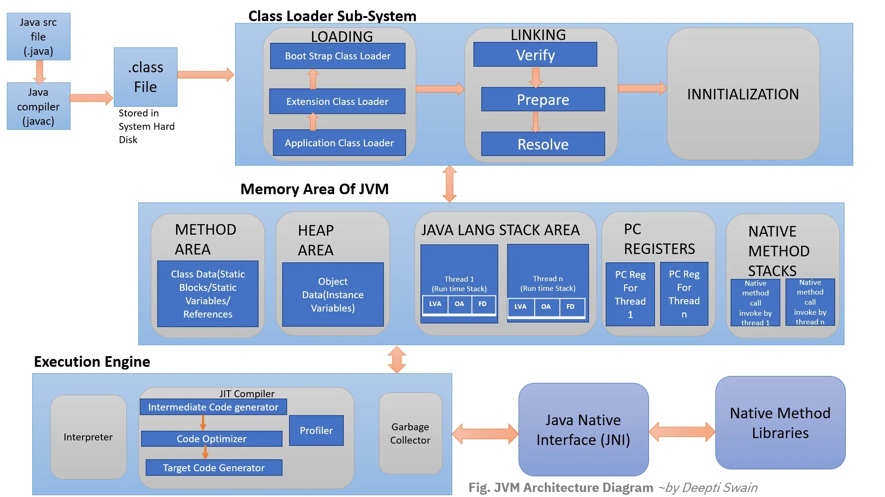

# TIL Template

## 날짜: 2026-05-13

### 스크럼
- 학습 목표 1 : 자바의 환경 이해
- 학습 목표 2 : GC에 대한 이해

### 새로 배운 내용
#### 주제 1: JAVA 환경
- JDK: 자바 애플리케이션을 개발하고 실행하기 위한 컴파일러, 라이브러리, 실행환경(JRE)을 포함한 개발 도구 모음
    - JRE: 자바 애플리케이션을 실행하기 위한 환경
      - JVM: 자바 바이트코드를 실행하는 가상 머신으로, 플랫폼 독립성을 보장하는 핵심 구성 요소
      - Java Class Library: 입출력, 문자열 처리, 네트워크 등 자바의 기본 기능을 제공하는 표준 API 집합
    - Development tool: 자바 애플리케이션을 작성, 컴파일, 디버깅, 배포하는 데 사용하는 도구 모음
- JDK 사용 이유: 자바 개발에 필요한 모든 도구를 통합해 빠르고 안정적인 개발을 가능하게 해주기 때문에
- 바이트코드: 자바 소스 파일을 컴파일한 후 생성되는 중간 단계의 코드로, `.class`확장자를 가짐

- 출처: Medium (by Deepti Swain)

#### 주제 2: Garbage Collection
- Garbage Collection: 더 이상 사용되지 않는 객체를 자동으로 메모리에서 제거하는 JVM의 메모리 관리 기능
    - 힙 영역을 주기적으로 스캔하여 도달할 수 없는 객체를 식별하고, 참조 그래프를 따라 살아있는 객체만 남긴 후 나머지 메모리를 해제
- 스택: 실행흐름을 담는 메모리 공간. 실행중인 메서드가 끝나면, 메모리 공간이 알아서 반환
- 힙: 모든 실행흐름들(스레드) 공통으로 바라볼 수 있는 메모리 저장공간

### 오늘의 도전 과제와 해결 방법
- 도전 과제 1: 개념 정리하기

### 오늘의 회고
- 스택과 힙에 대해 더 알아봐야겠다

### 참고 자료 및 링크
- [JAVA 응용](https://www.notion.so/adapterz/23e394a48061804a99eafa09067e64df?v=23e394a4806180c3acb7000c875f28ca&source=copy_link)

