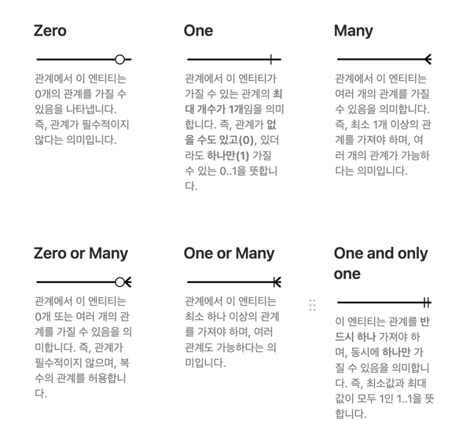
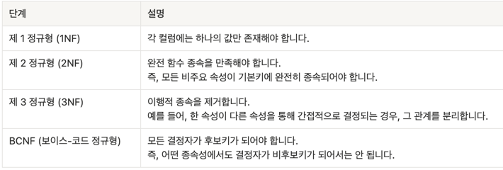

# TIL Template

## 날짜: 2026-05-26

### 스크럼
- 학습 목표 1 : ERD와 데이터베이스 이해사기
- 학습 목표 2 : Index, Full-Text Index의 개념 알기
- 학습 목표 3 : Transaction 이해하기

### 새로 배운 내용
#### 주제 1: ERD와 데이터베이스
- ERD: 개체와 관계를 한 눈에 알아볼 수 있도록 그려놓은 도표
  - 사용이유: 데이터베이스의 구조를 시각적으로 표현하여 데이터 간의 관계와 구조를 명확하게 이해하기 위해서
  - ERD 표기법
      - Crow’s Foot Notation (까마귀 발 표기법)
      - Peter Chen Notation (피터 챈 표기법)
      - Barker Notation (바커 표기법)
      
  - 정규화
    - 정규화 단계
    
  - 반정규화
    - 성능 향상을 위해 일부러 중복을 허용하거나 계산된 컬럼을 추가하는 등의 작업을 수행
- 데이터베이스: 자료를 정보로 활용하기 위해서 구조화 해놓은 데이터 모음
- RDB: 데이터를 테이블 체계로 저장하여, 데이터의 안정성과 신뢰성을 보장하기 위해서 사용
- RDBMS: 관계형 데이터베이스를 관리할 수 있는 프로그램
- 관계형 데이터베이스: 상호 연관된 데이터를 테이블 형태로 저장하고 제공하는 데이터베이스

#### 주제 2: Index, Full-Text Index
- ## Tree: 노드로 이루어진 자료구조
- 트리 구조(Tree Structure)는 계층적인 데이터 구조로, 부모-자식 관계를 가지는 노드(Node)들로 구성
- ## Binary Search Tree: 
1. 각 노드에 값이 있다.
2. 값들은 정렬된 순서가 있다.
  1. 이는 키 값들이 총순서를 가진다는 의미입니다. 즉, 트리 안에서 값을 비교할 때 항상 어느 값이 더 큰지 혹은 더 작은지 명확하게 알 수 있습니다.
3. 노드의 왼쪽 서브트리에는 그 노드의 값보다 작은 값들을 지닌 노드들로 이루어져 있다.
4. 노드의 오른쪽 서브트리에는 그 노드의 값보다 큰 값들을 지닌 노드들로 이루어져 있다.
5. 좌우 하위 트리는 각각이 다시 이진 탐색 트리여야 한다.

- 해시 인덱스
  - Hash Function
    - 입력 값을 넣으면 → 고정된 길이의 주소를 전달해주는 함수
      - Hash Value→주소값
      - 해당 주소에 실제 데이터를 위치시킨다.
    1. 데이터가 입력됨
      1. 톰이라는 데이터가 입력됨
    2. Hash Function 통과
      1. 0x42A
    3. 0x42A로 바로 접근할 수 있다.
      1. 중간 과정없이
      2. 트리 노드를 검색하거나, 링크드 리스트를 타고 돌아다니거나
      - 데이터의 양이 몇 건이든 해시 함수 계산 한 번 하면 데이터를 찾음
   - 단일 검색 속도가 가장 빠름
   - 인덱스 크기의 효율성이 좋음
- ## B-tree: 이진 트리와 달리 하나의 노드가 여러 개의 키와 자식 노드를 가질 수 있음
  - 모든 리프 노드는 같은 깊이에 위치하도록 유지되어, 트리의 높이가 자동으로 균형을 이룸
  - 이 구조 덕분에 검색, 삽입, 삭제 연산이 항상 로그 시간 복잡도(O(log n))를 유지
  - 트리 높이를 최소화하여 I/O 횟수를 줄이는 데 최적화된 구조
  - 내부 노드에서는 탐색을 위한 기준값,리프 노드에서는 실제 데이터를 대표하는 값
  
- ## B+tree: MySQL InnoDB 스토리지 엔진에서 인덱스를 관리하기 위해 사용하는 자료 구조
  - 여러 계층으로 구성된 동적 인덱스 구조로, 각 인덱스 세그먼트(일반적으로 페이지 또는 노드라고 부름)는 일정 범위의 키들을 저장하며 트리 전체의 균형을 유지
  - 트리의 높이를 최소화하여 I/O 비용을 줄임
  
- B-tree는 키와 레코드가 모든 노드에 저장될 수 있지만 (가능성), B+Tree는 모든 레코드가 트리의 최하위 레벨인 리프 노드에만 저장되고, 내부 노드에는 탐색 경로를 결정하기 위한 키만 존재
- 리프 노드들은 서로 연결 리스트 형태로 연결되어 있어 범위 조건 검색 시 다음 리프 노드로 연속 이동이 가능
- 이 구조에서는 범위 검색이 시작될 첫 번째 키를 찾기 위해서만 루트부터 리프까지 트리를 탐색하고, 그 이후에는 트리를 다시 타지 않고 리프 노드 간 연결만 따라가며 연속된 키들을 순차적으로 읽음

## B+Tree vs Hash Index 비교

| 구분 | B+Tree | Hash Index |
| :--- | :--- | :--- |
| **자료구조** | 균형잡힌 트리 (Balanced Tree) | 해시 테이블 (Hash Table) |
| **단일 검색 성능** | O(log N) (준수하고 일관된 성능) | O(1) (가장 빠른 속도) |
| **범위 검색** | **가능** (O(log N) + 리프 노드 순차 탐색) | **불가능** (정렬이 안 되어 있음) |
| **주요 용도** | RDB 주요 스토리지 엔진 (MySQL, Oracle 등) | NoSQL, 캐시 메모리(Redis), 알고리즘 최적화 |

- ## Index: 데이터베이스 분야에 있어 테이블에 대한 조회 동작의 속도를 높여주는 자료 구조
  - 클러스터형 인덱스:  데이터가 인덱스 순서대로 물리적으로 정렬되어 저장되는 인덱스
  - 비클러스터형 인덱스: 인덱스와 데이터가 물리적으로 분리되어 있어, 인덱스가 별도의 인덱스 테이블에 저장되고, 이 테이블에는 원본 데이터 위치를 가리키는 포인터만 포함되어 있는 인덱스(원본 데이터 참조)

- ## Full Text Index: 텍스트 검색에서 컴퓨터에 저장된 문서 또는 전문 데이터베이스를 검색하는 기법
  - ngram 파서
    - 지정된 글자 수만큼 자르는 파서
  - Stopword
    - 공백, 문장 부호(쉼표, 마침표) 단어를 분리
  - MeCab
    - N-gram 기계적 2글자씩 자르는 파

#### 주제 3: Transaction
- Transaction: 데이터베이스 관리 시스템 또는 유사한 시스템에서 상호작용의 단위
  - 데이터베이스의 무결성과 일관성을 보장하고, 여러 작업을 하나의 논리적인 작업 단위로 묶어서 처리하기 위해서
- ACID
  - Atomicity (원자성)
    - 트랜잭션이 완벽하게 수행이 되거나, 전혀 수행이 되지 않아야 함
  - Consistenty (일관성, 정합성)
    - 시스템이 가지고 있는 고정 요소는 트랜잭션 작업을 수행하기 전과 후의 상태가 같음
  - Isolation (독립성)
    - 다수의 트랜잭션이 동시에 병행 실행되고 있을 때, 어떤 트랜잭션도 다른 트랜잭션 연산에 끼어들 수 없음
  - Durability (지속성)
    - 트랜잭션이 성공적으로 완료되었으면, 결과는 영구적으로 반영
    
### 오늘의 도전 과제와 해결 방법
- 

### 오늘의 회고
- 오늘의 학습 경험에 대한 자유로운 생각이나 느낀 점을 기록합니다.
- 성공적인 점, 개선해야 할 점, 새롭게 시도하고 싶은 방법 등을 포함할 수 있습니다.

### 참고 자료 및 링크
- [데이터베이스 기초](https://www.notion.so/adapterz/24d394a4806180fa92d2da90c56488db?v=24d394a4806180f0b125000cb04907d4&source=copy_link)
- [링크 제목](URL)
